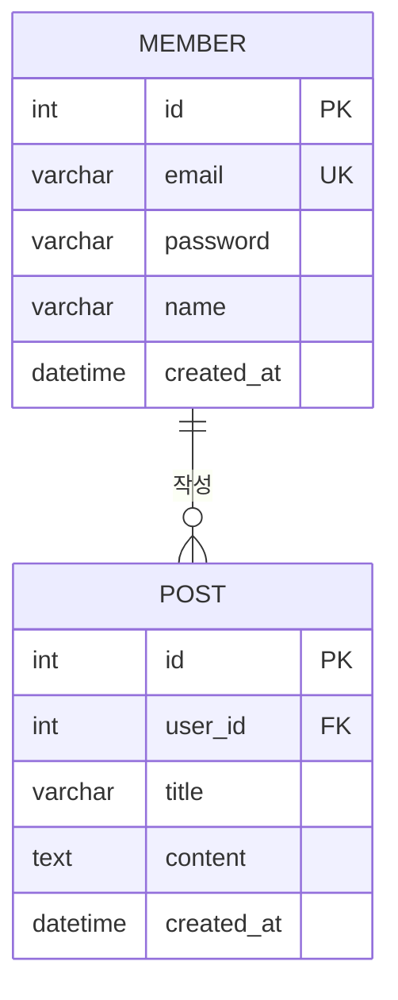

# 데이터베이스 심화 및 자바 연동

## 학습 목표
- 트랜잭션의 ACID 성질과 커밋, 롤백을 활용한 데이터 무결성 제어 원리 이해
- 자바 애플리케이션 연동을 위한 JDBC 동작 방식 및 커넥션 풀(HikariCP)의 특징 습득
- MyBatis 프레임워크를 활용한 SQL 매퍼 매핑 및 동적 SQL 활용 능력 배양
- 데이터베이스 성능 최적화를 위한 인덱스의 작동 구조, 실행 계획 조회 및 No-Offset 페이징 기법 습득
- Crow's Foot 표기법과 식별/비식별 관계 구분을 바탕으로 한 고급 ERD 모델링 기법 이해
- 회원, 게시판, 댓글 및 좋아요 다대다 관계 설계를 적용한 종합 데이터베이스 프로젝트 구현

## 목차
- [6. 트랜잭션의 이해](#6-트랜잭션의-이해)
  + [6.1 트랜잭션 개념과 ACID 성질](#61-트랜잭션-개념과-acid-성질)
  + [6.2 커밋(Commit)과 롤백(Rollback)](#62-커밋commit과-롤백rollback)
  + [6.3 데이터 무결성 제약의 이해](#63-데이터-무결성-제약의-이해)
- [7. JDBC (Java Database Connectivity)](#7-jdbc-java-database-connectivity)
  + [7.1 JDBC 동작 원리 및 주요 인터페이스](#71-jdbc-동작-원리-및-주요-인터페이스)
  + [7.2 JDBC 실습 예제](#72-jdbc-실습-예제)
  + [7.3 커넥션 풀(Connection Pool) 이해](#73-커넥션-풀connection-pool-이해)
- [8. MyBatis 연동](#8-mybatis-연동)
  + [8.1 MyBatis 구조와 환경 설정 (Mapper, XML 및 어노테이션 방식)](#81-mybatis-구조와-환경-설정-mapper-xml-및-어노테이션-방식)
  + [8.2 ResultMap과 Parameter 전달](#82-resultmap과-parameter-전달)
  + [8.3 동적 SQL (if, choose, foreach)](#83-동적-sql-if-choose-foreach)
  + [8.4 MyBatis 기반 CRUD 구현 실습](#84-mybatis-기반-crud-구현-실습)
- [9. 인덱스와 성능 기초](#9-인덱스와-성능-기초)
  + [9.1 인덱스(Index) 개념과 작동 원리](#91-인덱스index-개념과-작동-원리)
  + [9.2 쿼리 성능 저하 원인 분석](#92-쿼리-성능-저하-원인-분석)
  + [9.3 데이터베이스 실행 계획 확인](#93-데이터베이스-실행-계획-확인)
  + [9.4 페이징(Paging) 처리 기법](#94-페이징paging-처리-기법)
- [10. 데이터베이스 모델링](#10-데이터베이스-모델링)
  + [10.1 데이터베이스 모델링 개요](#101-데이터베이스-모델링-개요)
  + [10.2 데이터베이스 정규화 이론](#102-데이터베이스-정규화-이론)
  + [10.3 ERD 설계와 Crow's Foot 표기법](#103-erd-설계와-crows-foot-표기법)
  + [10.4 식별 관계와 비식별 관계의 구조적 구분](#104-식별-관계와-비식별-관계의-구조적-구분)
  + [10.5 대표적인 모델링 도구 및 설계 가이드라인](#105-대표적인-모델링-도구-및-설계-가이드라인)
- [11. 종합 프로젝트](#11-종합-프로젝트)
  + [11.1 회원 관리 모듈 데이터베이스 설계](#111-회원-관리-모듈-데이터베이스-설계)
  + [11.2 게시판 CRUD 및 검색, 페이징 설계](#112-게시판-crud-및-검색-페이징-설계)
  + [11.3 댓글과 좋아요 다대다 관계 설계](#113-댓글과-좋아요-다대다-관계-설계)

---

# 6. 트랜잭션의 이해

## 6.1 트랜잭션 개념과 ACID 성질

### 6.1.1 트랜잭션 정의
- 트랜잭션(Transaction)은 데이터베이스의 상태를 변경하는 작업들을 하나의 논리적 단위로 묶은 실행 흐름
- 예를 들어, A계좌에서 B계좌로 돈을 송금하는 프로세스는 A계좌 잔액 차감과 B계좌 잔액 증가라는 두 작업이(두번의 UPDATE 쿼리 실행) 모두 완료되거나, 혹은 둘 다 실패하여 원래대로 돌아가야만 데이터의 정합성이 유지됨.
- 이처럼 분리할 수 없는 작업 단위를 트랜잭션이라고 하며 데이터의 무결성을 지키기 위해 트랜잭션 단위로 전체 성공 또는 전체 실패 처리를 해야 함.

### 6.1.2 트랜잭션의 ACID 성질
- 데이터베이스 트랜잭션이 안전하게 수행되도록 보장하기 위해 다음과 같은 네 가지 핵심 규칙을 충족해야 함.

#### 1) 원자성 (Atomicity)
- 트랜잭션 내의 모든 연산이 데이터베이스에 완전히 반영되거나, 아니면 전혀 반영되지 않아야 함.
- 부분 성공은 허용하지 않으며, 단 하나의 작업이라도 실패할 경우 전체 트랜잭션을 취소 처리해야 함.

#### 2) 일관성 (Consistency)
- 트랜잭션이 성공적으로 완료된 후에도 데이터베이스는 미리 정의된 모든 유효 규칙과 제약조건을 만족하는 유효한 상태를 유지해야 함.
- 예시: 잔액 컬럼 값이 마이너스가 될 수 없다는 제약이 있다면, 트랜잭션 완료 후에도 이 조건이 반드시 충족되어야 함.

#### 3) 격리성 (Isolation)
- 동시에 실행되는 여러 트랜잭션들이 서로 간섭하지 않고 독립적으로 동작하도록 제어해야 함.
- 하나의 트랜잭션이 수행 중일 때 다른 트랜잭션이 중간 데이터에 접근하여 값을 수정할 수 없도록 차단하여 동시성 관련 모순을 예방하게 됨.
- 대다수의 RDBMS는 락킹(Locking) 대신 MVCC(Multi-Version Concurrency Control, 다중 버전 동시성 제어) 기법을 적용하여 읽기 작업의 격리성과 동시성을 동시에 끌어올리는 설계를 채택하고 있음.

#### 4) 지속성 (Durability)
- 성공적으로 완료된 트랜잭션의 결과는 시스템 장애나 정전 등의 상황이 발생하더라도 소멸되지 않고 데이터베이스에 영구적으로 기록되어야 함.
- 일반적으로 트랜잭션 로그를 디스크와 같은 비휘발성 저장 매체에 기록하여 보존성을 유지함.

## 6.2 커밋(Commit)과 롤백(Rollback)

### 6.2.1 커밋 (Commit)
- 트랜잭션 내부의 모든 변경 사항이 성공적으로 처리되었음을 확정하고, 이를 데이터베이스에 영구적으로 반영하는 제어 명령.
- 커밋이 완료된 데이터는 다른 세션 [^1]에서도 즉시 조회가 가능해지며, 롤백을 통해서도 이전 상태로 되돌릴 수 없는 영구 보존 상태로 전환됨.

### 6.2.2 롤백 (Rollback)
- 트랜잭션 실행 도중 오류가 발생하거나 조건이 충족되지 않았을 때, 지금까지 수행한 모든 변경 작업을 취소하고 트랜잭션 시작 이전의 상태로 데이터베이스를 복구하는 명령.
- 작업의 원자성을 보장하기 위해 실패 시 원래의 상태로 되돌리는 필수 안전장치로 작동하게 됨.

### 6.2.3 트랜잭션 제어 SQL
- 데이터베이스 CLI나 클라이언트 도구에서 트랜잭션을 수동으로 제어하는 방법
- DBeaver와 같은 데이터베이스 클라이언트 도구의 경우, 기본 설정이 자동 커밋(Auto-Commit) 모드로 되어 있어 명시적으로 트랜잭션을 시작하지 않으면 실행한 DML(INSERT, UPDATE, DELETE) 쿼리가 즉시 데이터베이스에 영구 반영됨.
- 수동으로 트랜잭션을 제어(Commit, Rollback)하려면 Database > Transaction mode > Manual Commit으로 변경하거나, START TRANSACTION 구문을 명시적으로 실행해야 함.
- 예시: 회원 탈퇴 시 작성한 게시글도 자동으로 삭제할 경우
  ```sql
  -- 1. 트랜잭션 시작
  START TRANSACTION;
  
  -- 2. 비즈니스 쿼리 실행 (탈퇴하는 회원이 작성한 게시글 전체 삭제)
  -- post 테이블의 member_id 외래 키(FK) 제약조건이 ON DELETE SET NULL로 설정되어 있으므로,
  -- 게시글 전체 삭제 옵션 적용을 위해 회원 삭제 전에 게시글을 먼저 명시적으로 삭제함.
  DELETE FROM post
  WHERE member_id = 2;
  
  -- 3. 비즈니스 쿼리 실행 (회원 정보 삭제)
  DELETE FROM member
  WHERE id = 2;
  
  -- 4. 정상 완료 시 영구 반영
  COMMIT;

  -- 4. 오류 상황 감지 시 원래 상태로 복구 (삭제한 게시글 원복)
  ROLLBACK;
  ```

### 6.2.4 트랜잭션 지원 여부에 따른 SQL 분류
- 모든 SQL 쿼리가 트랜잭션 제어(Commit, Rollback) 대상이 되는 것은 아님.
- RDBMS에 따라 트랜잭션 진행 중에 특정 쿼리를 실행하면 진행 중인 트랜잭션이 강제로 종료되고 즉시 커밋되는 현상(암묵적 커밋, Implicit Commit)이 발생함.

#### 1) 트랜잭션 처리가 가능한 SQL (DML)
- 대상: INSERT, UPDATE, DELETE 등 테이블 데이터를 조작하는 쿼리.
- 특징: 트랜잭션 내에서 실행한 작업 결과를 최종 확정하기 전까지 보류할 수 있으며, 오류 발생 시 ROLLBACK을 통해 트랜잭션 시작 이전 상태로 완전히 되돌리는 것이 가능함.

#### 2) 트랜잭션 처리가 불가능한 SQL (DDL, DCL)
- 대상: CREATE, ALTER, DROP, TRUNCATE 등 데이터베이스 객체를 정의하는 쿼리(DDL) 및 GRANT, REVOKE 등 권한을 설정하는 쿼리(DCL).
- 특징: 이들 쿼리는 실행 즉시 데이터베이스에 영구 반영됨. 특히 MySQL 등 대다수 RDBMS에서는 트랜잭션 도중 DDL/DCL 쿼리가 실행되면, 이전까지 수행한 DML 작업들이 시스템에 의해 강제로 커밋(암묵적 커밋)됨. 따라서 해당 쿼리 실행 이후에는 ROLLBACK을 호출해도 이전 상태로 복구할 수 없음.

### 6.2.5 데이터베이스 격리 수준 (Isolation Level)
- 동시에 실행되는 여러 트랜잭션들이 서로 얼마나 고립되어 있는지를 정의하는 설정.
- 격리 수준이 높을수록 데이터 일관성은 엄격하게 보장되지만 동시 처리 성능(동시성)은 저하되며, 격리 수준이 낮을수록 동시 처리 성능은 향상되지만 데이터 무결성 문제가 발생할 수 있음.

#### 1) 격리 수준에 따른 발생 가능한 데이터 부정합 문제
- Dirty Read: 특정 트랜잭션이 수정 중인 커밋되지 않은 데이터를 다른 트랜잭션이 조회할 수 있는 현상.
- Non-repeatable Read: 한 트랜잭션 안에서 동일한 데이터를 반복해서 조회했을 때, 중간에 다른 트랜잭션이 해당 데이터를 수정/삭제하고 커밋함으로써 조회 결과가 다르게 나타나는 현상.
- Phantom Read: 한 트랜잭션 안에서 동일한 조건의 데이터를 반복해서 조회했을 때, 중간에 다른 트랜잭션이 새로운 데이터를 추가하고 커밋함으로써 이전에 없던 데이터(유령 레코드)가 조회 결과에 나타나는 현상.

#### 2) RDBMS 격리 수준 4단계
- Read Uncommitted (미커밋 읽기):
  - 커밋되지 않은 데이터도 다른 트랜잭션이 읽을 수 있도록 허용하는 단계.
  - Dirty Read, Non-repeatable Read, Phantom Read 현상이 모두 발생 가능.
  - 성능은 가장 빠르나 데이터 일관성을 보장하지 못하므로 실무에서는 거의 사용하지 않음.
  - 예시: 대략적인 누적 방문자 수 집계처럼 일부 데이터에 오차가 생기더라도 대용량 트래픽의 처리 속도가 최우선인 실시간 통계 모니터링 시스템.
- Read Committed (커밋된 읽기):
  - 다른 트랜잭션이 커밋을 완료한 데이터만 조회할 수 있도록 허용하는 단계.
  - Dirty Read 현상은 방지되지만, Non-repeatable Read와 Phantom Read 현상은 발생 가능함.
  - 오라클(Oracle), SQL Server 등의 RDBMS에서 기본 격리 수준으로 사용함.
  - 예시: 쇼핑몰의 상품 목록 조회나 일반적인 게시판 글 조회. 조회 중 다른 사용자가 데이터를 수정하여 결과가 다소 달라지더라도 비즈니스상 치명적인 문제가 되지 않는 대부분의 일반 웹 서비스.
- Repeatable Read (반복 가능한 읽기):
  - 한 트랜잭션이 시작된 시점에 조회한 데이터는 해당 트랜잭션이 끝날 때까지 항상 동일한 결과를 유지하도록 보장하는 단계.
  - Dirty Read와 Non-repeatable Read 현상은 방지되지만, Phantom Read 현상은 발생할 수 있음 (다만 MySQL InnoDB 엔진의 경우 MVCC와 넥스트 키 락을 통해 이 단계에서도 Phantom Read 현상을 상당 부분 예방함).
  - MySQL/MariaDB의 기본 격리 수준.
  - 예시: 정밀한 회계 결산이나 일일 정산 보고서 작성 시스템. 트랜잭션이 진행되는 동안 다른 사용자가 기존 거래 내역을 수정하더라도, 처음 조회를 시작한 기준 시점의 데이터 일관성을 유지하며 정확한 정산 결과를 산출해야 하는 시스템.
- Serializable (직렬화 가능):
  - 가장 엄격한 격리 수준으로, 읽기 작업을 수행하는 테이블의 모든 행에 공유 락(Shared Lock)을 설정하여 다른 트랜잭션이 해당 데이터를 수정하거나 추가하지 못하게 완전히 차단함.
  - Dirty Read, Non-repeatable Read, Phantom Read 현상을 모두 완벽히 방지함.
  - 동시성 제어 효율과 처리량이 매우 떨어지므로 특수한 데이터 무결성이 극도로 보장되어야 하는 경우가 아니면 실무에서 거의 쓰지 않음.
  - 예시: 선착순 기차 좌석 예매나 한정판 쿠폰 발급 시스템. 여러 사용자가 동시에 동일한 자원에 접근하여 예매나 발급을 시도할 때, 중복 판매(Double Booking)나 초과 발급 등의 부정합이 절대로 일어나지 않아야 하는 시스템.

| 격리 수준 | Dirty Read | Non-repeatable Read | Phantom Read |
| :--- | :--- | :--- | :--- |
| Read Uncommitted | 발생 가능 | 발생 가능 | 발생 가능 |
| Read Committed | 방지됨 | 발생 가능 | 발생 가능 |
| Repeatable Read | 방지됨 | 방지됨 | 발생 가능 (MySQL은 대부분 예방) |
| Serializable | 방지됨 | 방지됨 | 방지됨 |

#### 3) MySQL 격리 수준 설정 및 확인 방법
- MySQL/MariaDB에서는 쿼리를 통해 현재 격리 수준을 확인하거나 변경할 수 있음.

- 현재 격리 수준 확인 쿼리:
  ```sql
  -- MySQL 8.0 이상
  SELECT @@transaction_isolation;
  
  -- MySQL 5.7 이하 [^4]
  SELECT @@tx_isolation;
  
  -- 글로벌(전체 세션) 및 현재 세션의 격리 수준 확인
  SELECT @@global.transaction_isolation, @@session.transaction_isolation;
  ```

- 격리 수준 설정 쿼리:
  ```sql
  -- 현재 세션의 격리 수준을 READ COMMITTED로 변경
  SET SESSION TRANSACTION ISOLATION LEVEL READ COMMITTED;
  
  -- 글로벌(전체 세션) 격리 수준을 REPEATABLE READ로 변경 (이후 접속하는 모든 세션에 적용)
  SET GLOBAL TRANSACTION ISOLATION LEVEL REPEATABLE READ;
  ```

- 설정 파일을 통한 영구 설정 (my.cnf 또는 my.ini):
  ```ini
  [mysqld]
  transaction-isolation = REPEATABLE-READ
  ```

## 6.3 데이터 무결성 제약의 이해

### 6.3.1 데이터 무결성 정의
- 데이터베이스에 저장된 데이터의 정확성, 일관성, 유효성을 보장하는 성질을 가리킴.
- 권한이 없는 사용자의 잘못된 입력이나 프로그램 오류 등으로 인해 일관성 없는 데이터가 쌓이는 현상을 규제하는 기능을 수행함.

### 6.3.2 주요 무결성 종류 및 구현 제약조건

#### 1) 개체 무결성 (Entity Integrity)
- 테이블의 기본 키(PK)는 null 값을 가질 수 없으며, 중복된 값을 가질 수도 없음.
- 테이블 내의 모든 행이 고유하게 식별되도록 규제하는 원칙.
- 구현 예시: PRIMARY KEY 제약조건 부여.

#### 2) 참조 무결성 (Referential Integrity)
- 외래 키(FK)의 값은 참조하는 다른 테이블의 기본 키 값과 일치하거나 null이어야 함.
- 관계가 맺어진 테이블 간의 데이터가 서로 모순 없이 유기적으로 연결되도록 보장함.
- 존재하지 않는 대상을 참조하는 유령 데이터를 원천 차단함.
- 구현 예시: FOREIGN KEY 제약조건 부여 및 ON DELETE 옵션 설정.

#### 3) 도메인 무결성 (Domain Integrity)
- 특정 컬럼에 입력되는 데이터가 사전에 정의된 데이터 타입, 길이, null 허용 여부 및 규칙 범위를 반드시 만족해야 함.
- 예를 들어, 이메일 형식이나 나이 컬럼에 음수가 들어오는 것을 차단해야 함.
- 구현 예시: NOT NULL, UNIQUE, CHECK 제약조건 지정.

---

# 7. JDBC (Java Database Connectivity)

## 7.1 JDBC 동작 원리 및 주요 인터페이스

### 7.1.1 JDBC 개요 및 구조
- JDBC는 자바 애플리케이션에서 다양한 관계형 데이터베이스에 표준화된 방식으로 접속하여 SQL을 실행할 수 있도록 지원하는 자바 표준 API 스펙.
- JDBC 인터페이스(Connection, Statement, PreparedStatement, ResultSet 등)는 java.sql 패키지에 정의되어 있으며, 실제 데이터베이스 제조사(MySQL, PostgreSQL 등)는 이 인터페이스를 구현한 JDBC 드라이버 라이브러리를 제공.

### 7.1.2 JDBC 드라이버의 역할과 로딩 메커니즘
#### 1) JDBC 드라이버 개념
- 자바 표준 JDBC API 인터페이스 요청을 특정 데이터베이스 제조사의 고유 통신 프로토콜[^33]로 변환하여 데이터를 송수신하는 라이브러리.
- 데이터베이스 제조사(MySQL, Oracle, PostgreSQL 등)는 각 제품에 특화된 드라이버(예: MySQL Connector/J)를 jar [^5] 파일 형태로 제공.

#### 2) JDBC 드라이버 종류 (Type 1 ~ Type 4)
- 과거에는 C/C++ 네이티브 라이브러리를 경유하는 드라이버 등이 사용되었으나, 현대에는 순수 자바 코드로만 작성되어 데이터베이스와 직접 소켓 통신을 수행하는 Type 4(Pure Java Driver) 방식이 표준으로 정착.
- 별도의 클라이언트 프로그램 설치 없이 jar 라이브러리 추가만으로 동작하여 이식성 [^6]이 매우 뛰어남.

#### 3) 드라이버 로딩 방식의 변화
- 과거 방식: Class.forName("com.mysql.cj.jdbc.Driver") 메서드를 통해 드라이버 클래스를 메모리에 동적으로 적재하여 초기화 수행.
- 현재 방식: JDBC 4.0 스펙 도입 이후 자바 SPI(Service Provider Interface)[^34] 메커니즘이 적용되어 드라이버 jar 파일 내의 META-INF/services/java.sql.Driver 설정 파일을 통해 DriverManager가 자동으로 설치된 드라이버를 감지하고 동적 로딩. 명시적인 드라이버 로딩 코드 작성 생략 가능.

#### 4) MySQL 드라이버 설정 정보
- 드라이버 클래스명: com.mysql.cj.jdbc.Driver (MySQL 8.0 이상 기준).
- JDBC 연결 URL 형식: jdbc:mysql://[호스트]:[포트]/[데이터베이스명][?properties]
- 주요 연결 옵션: 타임존 설정을 위한 serverTimezone=UTC 및 SSL 보안 연결 해제를 위한 useSSL=false 옵션 등이 주로 지정됨.
  - serverTimezone=UTC: 자바와 데이터베이스 간의 타임존(시간대) 차이를 보정하기 위해 데이터베이스 서버의 타임존이 UTC(세계 표준시)임을 명시.
  - useSSL=false: 로컬 개발 환경(localhost) 등 안전한 사설 네트워크망에서 접속할 때 보안 검증 단계를 생략하여 데이터베이스 연결을 빠르게 처리하고 관련 SSL 경고를 끄기 위해 지정.

### 7.1.3 드라이버 다운로드 및 설정
#### 1) 공식 홈페이지를 통한 드라이버 다운로드
- https://dev.mysql.com/downloads/connector/j/ 접속
- Select Operating System: Platform Independent 선택 > `Platform Independent (Architecture Independent), ZIP Archive` 항목의 Download 버튼 클릭.

#### 2) 프로젝트 내 jar 파일 수동 라이브러리 등록
- 압축을 풀어 드라이버 jar 파일(예: mysql-connector-j-xxx.jar)을 자바 프로젝트 폴더 내 임의의 라이브러리 폴더(예: lib)로 복사

#### 3) IntelliJ에서 라이브러리 등록
- IntelliJ > File > Project Structure... 선택
- Project Settings 섹션의 Libraries 선택
- `+` 버튼 눌러서 Java 선택
- JDBC 드라이버 파일 선택

### 7.1.4 JDBC 프로그래밍 단계별 프로세스
#### 1) 데이터베이스 연결 설정
- 데이터베이스 주소, 사용자 계정, 비밀번호 정보를 기반으로 데이터베이스와 연결 설정.

#### 2) SQL 실행 객체 획득 및 매개변수 바인딩
- 생성된 연결을 통해 데이터베이스에 전송할 SQL 실행 객체 준비.
- SQL 문에 필요한 매개변수를 바인딩하여 실행할 상태로 셋팅.

#### 3) SQL 실행
- 실행 객체를 통해 준비된 SQL 문을 데이터베이스에 전송하여 실제 실행을 요청.

#### 4) 결과 수신
- 실행 결과 데이터를 가져와 필요한 형태로 가공 및 추출하여 사용 (SELECT 쿼리의 경우).

#### 5) 연결 리소스 역순 해제
- 사용이 끝난 연결 객체와 실행 관련 리소스 [^7]를 생성 순서의 역순으로 안전하게 닫아 데이터베이스 자원을 반납.

### 7.1.5 JDBC 핵심 인터페이스 및 클래스 역할
#### 1) [DriverManager](https://docs.oracle.com/en/java/javase/25/docs/api/java.sql/java/sql/DriverManager.html) 클래스
- 애플리케이션에서 사용할 데이터베이스 드라이버를 관리하고 등록하는 역할 수행.
- 정의된 데이터베이스 연결 정보(URL, ID, PW)를 바탕으로 데이터베이스 커넥션을 생성하여 반환.
- 주요 메서드
  + Connection getConnection(String url, String user, String password): 지정된 데이터베이스 URL, 사용자 이름, 비밀번호를 사용하여 커넥션 객체를 획득하고 반환함.
- 예시
  ```java
  Connection conn = DriverManager.getConnection(DB_URL, DB_USER, DB_PASSWORD);
  ```

#### 2) [DataSource](https://docs.oracle.com/en/java/javase/25/docs/api/java.sql/javax/sql/DataSource.html) 인터페이스
- 데이터베이스와의 연결을 획득하기 위한 자바 표준 인터페이스.
- DB 접속 정보(주소, 계정 등)를 자바 소스 코드와 분리하여 결합도를 낮춤.
- 비즈니스 코드의 수정 없이 커넥션 풀 [^11] 적용 등 데이터베이스 연결 획득 방식을 자유롭게 바꿀 수 있도록 지원함.
- 주요 메서드
  + Connection getConnection(): 데이터베이스와의 연결을 설정하고 Connection 객체를 획득하여 반환함. (커넥션 풀을 사용하는 경우 풀에서 대여함)
- 예시
  ```java
  Connection conn = dataSource.getConnection();
  ```

#### 3) [Connection](https://docs.oracle.com/en/java/javase/25/docs/api/java.sql/java/sql/Connection.html) 인터페이스
- 특정 데이터베이스와 연결된 물리적 세션 [^1]<sup>2</sup>을 표현.
- 데이터베이스에 SQL 문을 전송하기 위한 Statement 또는 PreparedStatement 객체를 생성하는 역할.
- 트랜잭션의 시작, 커밋, 롤백 등의 트랜잭션 제어 기능 처리.
- 주요 메서드
  + Statement createStatement(): SQL 문을 데이터베이스로 전송하기 위한 기본 Statement 객체를 생성함.
  + PreparedStatement prepareStatement(String sql): 파라미터화된 SQL 문을 전송하기 위한 PreparedStatement 객체를 생성함.
  + void setAutoCommit(boolean autoCommit): 트랜잭션 자동 커밋 모드의 설정 여부를 지정함. (수동 커밋을 수행할 경우 false를 입력)
  + void commit(): 현재 트랜잭션의 변경 사항을 데이터베이스에 반영함.
  + void rollback(): 현재 트랜잭션의 변경 사항을 취소하고 이전 커밋 상태로 복구함.
  + void close(): Connection의 물리적 자원을 반환하고 연결을 종료함.
- 예시
  ```java
  Statement stmt = conn.createStatement();
  PreparedStatement pstmt = conn.prepareStatement("INSERT INTO member (email, password, name, phone) VALUES (?, ?, ?, ?)");
  ```

#### 4) [Statement](https://docs.oracle.com/en/java/javase/25/docs/api/java.sql/java/sql/Statement.html) 인터페이스
- SQL 쿼리문을 데이터베이스로 전송하여 실행하기 위한 기본 인터페이스.
- 실행 시마다 SQL 문을 새로 파싱하고 컴파일하는 과정을 거쳐 성능상 손실이 발생할 수 있으며, 쿼리 문자열을 더하기 방식으로 직접 생성할 경우 SQL Injection[^13] 취약점에 노출될 위험이 존재.
- 주요 메서드
  + ResultSet executeQuery(String sql): SELECT 문을 실행하고 결과로 ResultSet 객체를 반환함.
  + int executeUpdate(String sql): INSERT, UPDATE, DELETE 같은 DML 문 또는 DDL 문을 실행하고, 변경된 행의 개수를 반환함.
  + void close(): Statement 자원을 명시적으로 종료함.
- 예시
  ```java
  Statement stmt = conn.createStatement();
  ResultSet rs = stmt.executeQuery("SELECT id, email, name FROM member");
  int affectedRows = stmt.executeUpdate("UPDATE member SET name = '브롱이' WHERE id = 1");
  ```

#### 5) [PreparedStatement](https://docs.oracle.com/en/java/javase/25/docs/api/java.sql/java/sql/PreparedStatement.html) 인터페이스
- Statement의 하위 인터페이스로, 플레이스홀더(`?`)를 사용하여 사전에 컴파일된 SQL 문을 데이터베이스에 미리 캐싱해두고 재사용.
- 동일한 형태의 쿼리를 반복해서 수행할 때 실행 속도가 향상되며, 바인딩 변수에 대한 필터링을 자동으로 수행하여 SQL Injection을 원천 차단하므로 뛰어난 보안성 제공. 실무에서는 Statement 대신 PreparedStatement 사용을 권장.
- 주요 메서드
  + void setInt(int parameterIndex, int x) / void setString(int parameterIndex, String x) 등: SQL 문에 표시된 플레이스홀더(?)에 전달할 값을 데이터 타입별로 지정함.
  + ResultSet executeQuery(): 플레이스홀더에 바인딩된 상태로 SELECT 문을 실행하여 ResultSet 객체를 반환함.
  + int executeUpdate(): 플레이스홀더에 바인딩된 상태로 DML 문을 실행하여 변경된 행의 개수를 반환함.
  + void close(): PreparedStatement 자원을 명시적으로 종료함.
- 예시
  ```java
  PreparedStatement pstmt = conn.prepareStatement("INSERT INTO member (email, password, name, phone) VALUES (?, ?, ?, ?)");
  pstmt.setString(1, "brong@gmail.com");
  pstmt.setString(2, "123");
  pstmt.setString(3, "브롱이");
  pstmt.setString(4, "0102223333");
  int affectedRows = pstmt.executeUpdate();
  ```

#### 6) [ResultSet](https://docs.oracle.com/en/java/javase/25/docs/api/java.sql/java/sql/ResultSet.html) 인터페이스
- 데이터베이스로부터 데이터를 가져오는 SELECT 쿼리의 실행 결과인 레코드 집합을 처리하는 인터페이스.
- 내부적으로 커서(Cursor) 형태로 결과 데이터를 가리키며, next() 메서드를 호출하여 한 행씩 데이터를 검사하며 읽어올 수 있음. getString(), getInt() 등 컬럼 타입별 메서드를 사용하여 데이터 추출.

- 주요 메서드
  + boolean next(): 커서를 다음 행으로 한 칸 이동시키며, 다음 데이터가 존재하면 true를 반환하고 없으면 false를 반환함.
  + int getInt(String columnLabel) / String getString(String columnLabel) 등: 현재 커서 위치의 레코드에서 지정된 컬럼명의 값을 각 데이터 타입에 맞게 추출함.
  + void close(): ResultSet 자원을 명시적으로 종료함.
- 예시
  ```java
  ResultSet rs = pstmt.executeQuery();
  while (rs.next()) {
    int id = rs.getInt("id");
    String email = rs.getString("email");
  }
  ```

### 7.1.6 JDBC 자원 반납의 중요성과 방법
- JDBC 작업은 데이터베이스 연결 설정, SQL 실행 객체 획득, SQL 실행, 결과 수신, 연결 리소스 역순 해제의 5단계 라이프사이클로 구성.
- 데이터베이스 자원은 메모리 누수를 막기 위해 반드시 명시적으로 닫아주어야 함.
- 자바 7부터 지원되는 try-with-resources 방식을 도입하면 사용된 객체들이 예외 발생 여부와 상관없이 자동으로 닫히므로 안전하고 깔끔하게 리소스 반납 가능.

## 7.2 JDBC 실습 예제

### 7.2.1 데이터베이스 회원 조회 및 추가 예제
- 순수 JDBC와 PreparedStatement, ResultSet을 활용하여 MySQL 데이터베이스의 회원(member) 정보를 조회하고 신규 회원을 추가하는 자바 실습 예제.

```java
package ch05;

import java.sql.Connection;
import java.sql.DriverManager;
import java.sql.PreparedStatement;
import java.sql.ResultSet;
import java.sql.SQLException;

public class JdbcBasicTest {

  // serverTimezone=UTC: 자바 애플리케이션과 MySQL 데이터베이스 서버 간의 시간대(Timezone) 규격을 동기화하기 위한 설정
  // useSSL=false: 데이터베이스와 통신할 때 SSL(암호화된 안전한 연결 채널)을 사용하지 않겠다고 명시
  // allowPublicKeyRetrieval=true: 비밀번호 암호화를 위해 데이터베이스 서버의 공개 키를 가져옴
  private static final String DB_URL = "jdbc:mysql://localhost:3306/board_db?serverTimezone=UTC&useSSL=false&allowPublicKeyRetrieval=true";
  private static final String DB_USER = "user1";
  private static final String DB_PASSWORD = "1111";

  public static void main(String[] args) {
    // 신규 회원 등록
    insertMember("brong" + (int)(Math.random()*1000) + "@gmail.com", "pwd123", "브롱이", "01012345678");

    // 전체 회원 조회
    selectAllMembers();
  }

  // 회원 목록 조회 메서드
  public static void selectAllMembers() {
    String sql = "SELECT id, email, name, phone, created_at FROM member";
    Connection conn = null;
    Statement stmt = null;
    ResultSet rs = null;

    try {
      // 1. 데이터베이스 연결 설정(Connection 객체 생성)
      conn = DriverManager.getConnection(DB_URL, DB_USER, DB_PASSWORD);
      // 2. SQL 실행 객체 획득(Statement 객체 생성)
      stmt = conn.createStatement(sql);
      // 3. SQL 실행
      rs = stmt.executeQuery();

      System.out.println("--- 회원 목록 조회 결과 ---");
      // 4. 결과 수신
      // 커서를 다음 행으로 이동시키며 데이터가 존재할 때까지 반복
      while (rs.next()) {
        int id = rs.getInt("id");
        String email = rs.getString("email");
        String name = rs.getString("name");
        String phone = rs.getString("phone");
        String createdAt = rs.getString("created_at");

        System.out.println("ID: " + id + ", 이메일: " + email + ", 이름: " + name + ", 연락처: " + phone + ", 가입일: " + createdAt);
      }
      System.out.println("-------------------------");

    } catch (SQLException e) {
      System.out.println("데이터베이스 조회 중 오류 발생: " + e.getMessage());
      e.printStackTrace();
    } finally {
      // 5. 연결 리소스 역순 해제
      if (rs != null) { try { rs.close(); } catch (SQLException e) { e.printStackTrace(); } }
      if (stmt != null) { try { stmt.close(); } catch (SQLException e) { e.printStackTrace(); } }
      if (conn != null) { try { conn.close(); } catch (SQLException e) { e.printStackTrace(); } }
    }
  }

  // 회원 추가 메서드
  public static void insertMember(String email, String password, String name, String phone) {
    String sql = "INSERT INTO member (email, password, name, phone) VALUES (?, ?, ?, ?)";
    Connection conn = null;
    PreparedStatement pstmt = null;

    try {
      // 1. 데이터베이스 연결 설정(Connection 객체 생성)
      conn = DriverManager.getConnection(DB_URL, DB_USER, DB_PASSWORD);
      // 2. SQL 실행 객체 획득(PreparedStatement 객체 생성)
      pstmt = conn.prepareStatement(sql);

      // 2. 매개변수 바인딩(sql 구문의 ? 값 채움)
      pstmt.setString(1, email);
      pstmt.setString(2, password);
      pstmt.setString(3, name);
      pstmt.setString(4, phone);

      // 3. SQL 실행, 4. 결과 수신
      // INSERT, UPDATE, DELETE 쿼리는 executeUpdate()를 사용하여 영향받은 행의 수를 반환받음
      int affectedRows = pstmt.executeUpdate();

      System.out.println("회원 등록 성공: " + affectedRows + "개 행 영향 받음");

    } catch (SQLException e) {
      System.out.println("데이터베이스 처리 중 오류 발생: " + e.getMessage());
      e.printStackTrace();
    } finally {
      // 5. 연결 리소스 역순 해제
      if (pstmt != null) { try { pstmt.close(); } catch (SQLException e) { e.printStackTrace(); } }
      if (conn != null) { try { conn.close(); } catch (SQLException e) { e.printStackTrace(); } }
    }
  }
}
```

## 7.3 커넥션 풀(Connection Pool) 이해

### 7.3.1 커넥션 풀 개념
- 자바 애플리케이션에서 데이터베이스와 물리적인 연결(Connection)을 새로 맺는 과정은 네트워크 통신 및 데이터베이스 인증 절차로 인해 많은 비용과 시간이 소요되는 연산.
- 동시 요청이 많을 때 매번 연결을 맺고 끊는 방식은 서버 자원의 급격한 낭비와 성능 저하를 초래할 수 있음.
- 커넥션 풀은 애플리케이션 시작 시점에 필요한 데이터베이스 커넥션 객체들을 미리 생성하여 메모리 풀 영역에 보관해 두는 기술.
- 클라이언트 요청이 들어오면 풀에서 대기 중인 커넥션을 즉시 대여하고, 작업이 완료된 후에는 물리적으로 연결을 끊는 대신 풀에 반납하여 재사용하도록 함.
- 대표적인 자바 커넥션 풀 라이브러리로는 가볍고 빠른 성능을 제공하는 [HikariCP](https://github.com/brettwooldridge/hikaricp) 가 널리 채택되어 사용되고 있음.

### 7.3.2 커넥션 풀 관련 자바 표준 인터페이스
#### 1) [DataSource](https://docs.oracle.com/en/java/javase/25/docs/api/java.sql/javax/sql/DataSource.html) 인터페이스
- 자바 진영에서는 커넥션 풀을 구현한 다양한 라이브러리들을 표준화된 방식으로 사용할 수 있도록 javax.sql.DataSource 인터페이스를 제공.
- 기존 DriverManager 방식은 DB 연결 정보가 코드에 강하게 결합되는 한계가 있지만, DataSource를 활용하면 설정 정보와 커넥션 획득 로직을 물리적으로 분리 가능.
- 애플리케이션 코드는 구체적인 커넥션 풀 클래스에 의존하지 않고, DataSource 인터페이스의 getConnection() 메서드를 통해서만 커넥션을 획득하여 결합도 완화.
- 주요 메서드
  + Connection getConnection(): 데이터베이스와의 연결을 설정하고 Connection 객체를 획득하여 반환함. 커넥션 풀을 사용하는 경우 풀에서 대기 중인 커넥션을 대여함.

#### 2) HikariDataSource 구현체
- HikariCP의 핵심 구현체 클래스.
- DataSource 인터페이스를 구현하고 있어 표준 API 사용법을 그대로 유지하면서 고성능 커넥션 풀링 혜택 제공.

### 7.3.3 HikariCP 다운로드 및 설정
- HikariCP는 내부적으로 로깅을 위해 SLF4J 라이브러리를 사용하므로, 실행 시 NoClassDefFoundError 오류를 예방하기 위해 slf4j-api.jar 및 slf4j-simple.jar 파일도 함께 다운로드하여 등록해야 함.

#### 1) 다운로드
- HikariCP: https://repo1.maven.org/maven2/com/zaxxer/HikariCP/ 접속 후 최신 버전(7.1.0) 선택해서 HikariCP-7.1.0.jar 다운로드
  + 자세한 사용법은 https://github.com/brettwooldridge/HikariCP 참고
- SLF4J API (필수): https://repo1.maven.org/maven2/org/slf4j/slf4j-api/ 접속 후 최신 버전(2.0.18) 선택해서 slf4j-api-2.0.18.jar 다운로드
  + 자세한 사용법은 https://www.slf4j.org/ 참고
- SLF4J Simple (콘솔 출력용): https://repo1.maven.org/maven2/org/slf4j/slf4j-simple/ 접속 후 최신 버전(2.0.18) 선택해서 slf4j-simple-2.0.18.jar 다운로드
  + 자세한 사용법은 https://www.slf4j.org/ 참고

#### 2) 프로젝트 내 jar 파일 수동 라이브러리 등록
- 다운로드한 세 개의 jar 파일(HikariCP-7.1.0.jar, slf4j-api-2.0.18.jar, slf4j-simple-2.0.18.jar)을 자바 프로젝트 폴더 내 lib 폴더로 복사

#### 3) IntelliJ에서 라이브러리 등록
- IntelliJ > File > Project Structure... 선택
- Project Settings 섹션의 Libraries 선택
- `+` 버튼 눌러서 Java 선택
- 복사한 세 개의 jar 파일들을 선택하여 등록

### 7.3.4 커넥션 풀 설정
- 커넥션 풀을 설정하는 방법은 크게 두 가지로 분류됨.
- 첫 번째는 자바 코드 내에서 직접 메서드를 호출하여 설정하는 메서드 방식.
- 두 번째는 별도의 설정 파일에 작성한 후 불러오는 properties 방식.

#### 1) 메서드 방식
- 자바 소스 코드 내에서 HikariConfig 객체를 생성하고 관련 메서드를 직접 호출하여 커넥션 풀을 설정하는 방식.

```java
HikariConfig config = new HikariConfig();
config.setJdbcUrl("jdbc:mysql://localhost:3306/board_db?serverTimezone=UTC&useSSL=false&allowPublicKeyRetrieval=true");
config.setUsername("user1");
config.setPassword("1111");

// 세부 설정
config.setMaximumPoolSize(10); // 풀에 보관할 최대 커넥션 개수
config.setMinimumIdle(5); // 풀에서 대기할 최소 커넥션 개수
config.setConnectionTimeout(30 * 1000); // 커넥션 획득 대기 최대 시간 (30초)
config.setIdleTimeout(10 * 60 * 1000); // 쉬는 커넥션이 풀에서 제거되기 전 최대 유휴 시간 (10분)

DataSource dataSource = new HikariDataSource(config);
```

#### 2) properties 방식
- 데이터베이스 접속 정보 및 커넥션 풀 설정을 외부 설정 파일로 관리하는 방식.
- 코드 변경 없이 설정값을 수정할 수 있어 환경 변화에 대처하기 수월함.

- 설정 파일 예시 (resources/hikari.properties 파일)
```properties
jdbcUrl=jdbc:mysql://localhost:3306/board_db?serverTimezone=UTC&useSSL=false&allowPublicKeyRetrieval=true
username=user1
password=1111
maximumPoolSize=10
minimumIdle=5
connectionTimeout=30000
idleTimeout=600000
```

```java
HikariConfig config = new HikariConfig("./db.properties");
HikariDataSource dataSource = new HikariDataSource(config);
```

### 7.3.5 HikariCP 기반 커넥션 풀 실습
```java
package ch07;

import com.zaxxer.hikari.HikariConfig;
import com.zaxxer.hikari.HikariDataSource;
import javax.sql.DataSource;
import java.sql.*;

public class JdbcBasicTestTemp {

    private static DataSource dataSource;

    static {
        // 1. HikariCP 설정을 위한 HikariConfig 객체 생성
        HikariConfig config = new HikariConfig();
        config.setJdbcUrl("jdbc:mysql://localhost:3306/board_db?serverTimezone=UTC&useSSL=false&allowPublicKeyRetrieval=true");
        config.setUsername("user1");
        config.setPassword("1111");

        // 커넥션 풀 옵션 세부 설정
        config.setMaximumPoolSize(10); // 풀에 보관할 최대 커넥션 개수
        config.setMinimumIdle(5); // 풀에서 유효 상태로 대기할 최소 커넥션 개수
        config.setConnectionTimeout(30 * 1000); // 커넥션 획득 대기 최대 시간 (30초)
        config.setIdleTimeout(10 * 60 * 1000); // 쉬는 커넥션이 풀에서 제거되기 전 최대 유휴 시간 (10분)

        // 2. 설정 정보를 기반으로 HikariDataSource 생성 (DataSource 인터페이스로 업캐스팅하여 관리)
        dataSource = new HikariDataSource(config);
    }

    public static void main(String[] args) {
        // 전체 회원 조회
        selectAllMembers();
    }

    // 회원 목록 조회 메서드
    public static void selectAllMembers() {
        String sql = "SELECT id, email, name, phone, created_at FROM member";
        Connection conn = null;
        PreparedStatement pstmt = null;
        ResultSet rs = null;

        try {
            // 1. 데이터베이스 연결 설정(Connection 객체 생성)
            // dataSource.getConnection() 호출 시 새로운 연결을 생성하지 않고 풀에서 기존 연결을 대여해 옴
            conn = dataSource.getConnection();
            // 2. SQL 실행 객체 획득(PreparedStatement 객체 생성)
            pstmt = conn.prepareStatement(sql);
            // 3. SQL 실행
            rs = pstmt.executeQuery();

            System.out.println("--- 회원 목록 조회 결과 ---");
            // 4. 결과 수신
            // 커서를 다음 행으로 이동시키며 데이터가 존재할 때까지 반복
            while (rs.next()) {
                int id = rs.getInt("id");
                String email = rs.getString("email");
                String name = rs.getString("name");
                String phone = rs.getString("phone");
                String createdAt = rs.getString("created_at");

                System.out.println("ID: " + id + ", 이메일: " + email + ", 이름: " + name + ", 연락처: " + phone + ", 가입일: " + createdAt);
            }
            System.out.println("-------------------------");

        } catch (SQLException e) {
            System.out.println("데이터베이스 조회 중 오류 발생: " + e.getMessage());
            e.printStackTrace();
        } finally {
            // 5. 연결 리소스 역순 해제
            try{ if(rs != null) rs.close(); } catch (Exception e){ }
            try{ if(pstmt != null) pstmt.close(); } catch (Exception e){ }
            try{ if(conn != null) conn.close(); } catch (Exception e){ }
        }
    }
}
```

---

# 8. MyBatis 연동

## 8.1 MyBatis 구조와 환경 설정 (Mapper, XML 및 어노테이션 방식)

### 8.1.1 MyBatis 란?
- MyBatis 는 자바 객체와 SQL 쿼리를 매핑해 주는 SQL Mapper 프레임워크.
- 기존 JDBC [^8]의 복잡한 자원 반납 절차와 쿼리 문자열 결합의 불편함을 제거하고, SQL 쿼리를 자바 소스 코드와 분리하여 깔끔하게 관리할 수 있도록 지원함.
- SQL 쿼리를 개발자가 직접 최적화할 수 있도록 지원하며, 객체 관계를 알아서 매핑해주는 프레임워크인 JPA[^35] 등과는 설계 지향점이 다름.
- MyBatis는 내부적으로 PreparedStatement [^9]를 사용하여 데이터 접근 속도를 높이고 쿼리 바인딩 무결성을 확보함.
- 스프링 프레임워크와의 연동성이 뛰어나 자바 백엔드 생태계에서 널리 활용되고 있음.
- MyBatis 공식 문서(한국어): https://mybatis.org/mybatis-3/ko/index.html

#### MyBatis 도입의 주요 이유 (JDBC와의 비교)
- 보일러플레이트 코드 제거: JDBC API를 사용할 때마다 반복되던 Connection, PreparedStatement, ResultSet 객체의 수동 생성 및 예외 처리, 그리고 try-catch-finally를 활용한 복잡한 리소스 반납(close) 과정을 프레임워크가 전적으로 대행하여 커넥션 누수를 방지함.
- SQL 가독성 및 유지보수성 향상: 자바 소스 코드 내에서 문자열 연산자(+)로 길고 복잡한 SQL을 조립하여 하드코딩하는 대신, XML 파일에 완전히 격리하여 관리함으로써 쿼리의 수정과 작성이 편리해짐.
- 자동 결과 매핑: SELECT 쿼리의 실행 결과인 ResultSet으로부터 데이터를 행마다 추출해 DTO[^38]나 VO[^39] 객체에 하나씩 셋팅하던 수작업을, 명시한 resultType의 클래스로 MyBatis가 자동 매핑해 채워줌.
- 유연한 동적 SQL 처리: 다중 검색 필터나 가변 인자 조회 시 if, choose, foreach 등의 XML 제어 태그를 지원하여 문자열 더하기 수식 없이 깔끔하고 안전하게 쿼리를 완성할 수 있게 도와줌.

### 8.1.2 MyBatis 구성 요소
- SqlSessionFactoryBuilder: 설정 정보를 읽어 SqlSessionFactory 객체를 빌드하는 역할을 수행.
- SqlSessionFactory: 데이터베이스 연결 세션 [^1]<sup>3</sup>을 관리하는 SqlSession 객체를 생성해 주는 팩토리 클래스[^36] 역할을 담당.
- SqlSession: 데이터베이스에서 SQL을 직접 실행하고 트랜잭션 [^10]을 제어하는 핵심 메서드들을 제공.
- Mapper Interface: XML[^37]에 작성한 SQL 쿼리 아이디와 매핑되는 자바 인터페이스 메서드를 정의하여 사용자가 간결하게 호출하도록 지원함.

### 8.1.3 MyBatis 다운로드 및 설정
#### 1) MyBatis 다운로드
- https://repo1.maven.org/maven2/org/mybatis/mybatis/ 접속 후 최신 버전(3.5.19) 폴더로 들어가 mybatis-3.5.19.jar 파일을 다운로드

#### 2) 프로젝트 내 jar 파일 수동 라이브러리 등록
- 다운로드한 mybatis-3.5.19.jar 파일을 자바 프로젝트 폴더 내 lib 폴더로 복사

#### 3) IntelliJ에서 라이브러리 등록
- IntelliJ > File > Project Structure... 선택
- Project Settings 섹션의 Libraries 선택
- `+` 버튼 눌러서 Java 선택
- 복사해 둔 mybatis-3.5.19.jar 파일 선택

### 8.1.4 MyBatis 환경 설정 방식 비교
- MyBatis는 쿼리를 정의하는 방식에 따라 XML 설정 방식과 어노테이션 설정 방식을 선택하여 구현할 수 있음.

#### 1) XML 기반 설정 방식
- SQL 쿼리를 전용 XML 매퍼 파일에 별도로 보관하고, 자바 Mapper 인터페이스 메서드와 연결해 주는 방식.
- 쿼리가 복잡하거나 길어질 때 자바 코드와 완전히 분리하여 가독성을 높일 수 있으며, 유지보수가 용이하다는 장점이 있음.

- Properties 설정 (resources/mybatis.properties)
  ```properties
  jdbc.driver=com.mysql.cj.jdbc.Driver
  jdbc.url=jdbc:mysql://localhost:3306/board_db?serverTimezone=UTC&useSSL=false&allowPublicKeyRetrieval=true
  jdbc.username=user1
  jdbc.password=1111
  ```

- XML 방식의 MyBatis 설정 파일 (resources/mybatis-config.xml)
  ```xml
  <?xml version="1.0" encoding="UTF-8" ?>
  <!DOCTYPE configuration
          PUBLIC "-//mybatis.org//DTD Config 3.0//EN"
          "https://mybatis.org/dtd/mybatis-3-config.dtd">
  <configuration>

      <!-- 외부 프로퍼티 파일을 로드 -->
      <properties resource="mybatis.properties"/>

      <environments default="development">
          <environment id="development">
              <transactionManager type="JDBC"/>
              <dataSource type="POOLED">
                  <!-- mybatis.properties 내부의 키 이름을 사용하여 치환 -->
                  <property name="driver" value="${jdbc.driver}"/>
                  <property name="url" value="${jdbc.url}"/>
                  <property name="username" value="${jdbc.username}"/>
                  <property name="password" value="${jdbc.password}"/>
              </dataSource>
          </environment>
      </environments>
      <mappers>
          <mapper resource="mappers/PostMapper.xml"/>
      </mappers>
  </configuration>
  ```

- Mapper 인터페이스 (ch08/PostMapper.java)
  ```java
  package ch08;
  public interface PostMapper {
      Post findById(int id);
  }
  ```

- XML 매퍼 예시 (resources/mappers/PostMapper.xml)
  ```xml
  <mapper namespace="ch08.PostMapper">
      <select id="findById" parameterType="int" resultType="ch08.Post">
          SELECT id, title, content, view_count AS viewCount, created_at AS createdAt
          FROM post WHERE id = #{id}
      </select>
  </mapper>
  ```

#### 2) 어노테이션 기반 설정 방식
- 자바 Mapper 인터페이스 메서드 선언부 위에 직접 SQL 쿼리 어노테이션(@Select, @Insert, @Update, @Delete)을 부여하여 정의.
- 별도의 XML 매퍼 파일을 생성할 필요가 없어 설정 구조가 단순해지는 장점이 있음.
- 단, 쿼리가 길어지거나 동적 SQL을 구현할 때 자바 소스 코드 내에서 문자열 형태로 작성해야 하므로 가독성이 급격히 저하되는 한계가 있음.
- 어노테이션 방식 예시 (MemberMapperAnnotation.java)
  ```java
  package com.example.mapper;
  
  import com.example.model.Member;
  import org.apache.ibatis.annotations.Select;
  
  public interface MemberMapperAnnotation {
    @Select("SELECT id, email, password, name, created_at AS createdAt FROM member WHERE id = #{id}")
    Member findById(int id);
  }
  ```

## 8.2 ResultMap과 Parameter 전달

### 8.2.1 Parameter 전달 방식
- MyBatis에서 SQL 쿼리로 자바 객체의 데이터를 전달하는 주요 기법은 다음과 같음.

#### 1) 단일 파라미터 전달
- 메서드의 매개변수가 하나인 경우, 변수명과 관계없이 #{id} 와 같은 바인딩 변수 형태로 SQL 내에 즉시 매핑됨.

#### 2) 객체 기반 파라미터 전달
- 전달하려는 데이터가 여러 개인 경우, DTO나 엔티티 클래스 객체 자체를 매개변수로 전달할 수 있음.
- MyBatis는 객체 내부 필드명과 일치하는 getter 메서드를 자동 매핑하여 #{email}, #{name} 과 같이 값을 바인딩하도록 설계됨.

#### 3) @Param 어노테이션을 이용한 다중 파라미터 전달
- 별도의 객체를 정의하기 모호하거나 다수의 기본 타입을 독립적으로 전송하고 싶을 때 사용.
- @Param 어노테이션에 지정한 속성 이름을 기준으로 SQL 내의 바인딩 변수와 매핑 처리를 수행.
- 예시 코드 (MemberMapper.java)
  ```java
  void updatePassword(@Param("id") int id, @Param("newPassword") String newPassword);
  ```
- XML 매퍼 매핑 (MemberMapper.xml)
  ```xml
  <update id="updatePassword">
    UPDATE member
    SET password = #{newPassword}
    WHERE id = #{id}
  </update>
  ```

### 8.2.2 ResultMap 활용
- 관계형 데이터베이스의 컬럼명 규격과 자바 객체의 필드명 규격이 서로 불일치할 때 매핑을 보완해 주는 기능.
- 단순히 AS 키워드를 활용한 SQL 별칭 부여 방식으로 ResultSet [^14]의 컬럼명을 우회할 수도 있으나, 매핑 관계가 복잡하거나 조인 쿼리를 처리할 때 resultMap 요소를 선언하여 명시적으로 정의하는 방식을 추천.
- ResultMap 정의 예시 (MemberMapper.xml)
  ```xml
  <resultMap id="memberResultMap" type="com.example.model.Member">
    <id property="id" column="id"/>
    <result property="email" column="email"/>
    <result property="password" column="password"/>
    <result property="name" column="name"/>
    <result property="createdAt" column="created_at"/>
  </resultMap>
  
  <select id="findAll" resultMap="memberResultMap">
    SELECT id, email, password, name, created_at
    FROM member
  </select>
  ```

## 8.3 동적 SQL (if, choose, foreach)

### 8.3.1 동적 SQL 정의 및 필요성
- 비즈니스 요구사항에 따라 조회 조건이 시시각각 달라지거나 검색 필터 조합이 동적으로 결정되어야 하는 케이스가 자주 발생함.
- 순수 JDBC 환경에서는 조건문에 맞춰 쿼리 문자열을 문자열 연결 연산자로 조립해야 하므로 코드 복잡도가 극대화되고 오작동 위험이 높음.
- MyBatis는 XML 매퍼 내에 직관적인 논리 태그를 제공하여 상황에 맞게 쿼리가 동적으로 생성되도록 제어할 수 있음.

### 8.3.2 주요 동적 SQL 태그 사용법

#### 1) `<if>` 태그
- 주어진 조건(test 속성)이 참일 때만 해당 SQL 조각을 쿼리에 결합.
- 예시 코드 (MemberMapper.xml)
  ```xml
  <select id="searchMembers" resultType="com.example.model.Member">
    SELECT id, email, name, created_at AS createdAt
    FROM member
    WHERE 1=1
    <if test="email != null and email != ''">
      AND email LIKE CONCAT('%', #{email}, '%')
    </if>
    <if test="name != null and name != ''">
      AND name LIKE CONCAT('%', #{name}, '%')
    </if>
  </select>
  ```

#### 2) `<choose>`, `<when>`, `<otherwise>` 태그
- 자바의 switch 문이나 다중 if-else 문과 유사하게 작동하며, 나열된 조건 중 가장 먼저 만족하는 하나의 구문만 선택적으로 실행함.
- 예시 코드 (MemberMapper.xml)
  ```xml
  <select id="findMembersSorted" resultType="com.example.model.Member">
    SELECT id, email, name, created_at AS createdAt
    FROM member
    ORDER BY
    <choose>
      <when test="sortBy == 'email'">
        email ASC
      </when>
      <when test="sortBy == 'name'">
        name ASC
      </when>
      <otherwise>
        created_at DESC
      </otherwise>
    </choose>
  </select>
  ```

#### 3) `<foreach>` 태그
- 컬렉션(List, Array)을 전달받아 내부의 값을 순회하며 괄호와 콤마를 포함한 반복 쿼리 구문을 조립할 때 유용하게 사용됨.
- 주로 IN 절을 구성하거나 다중 레코드를 일괄 삽입할 때 활용.
- 예시 코드 (MemberMapper.xml)
  ```xml
  <select id="findByIds" resultMap="memberResultMap">
    SELECT id, email, name, created_at
    FROM member
    WHERE id IN
    <foreach item="item" index="index" collection="idList"
      open="(" separator="," close=")">
      #{item}
    </foreach>
  </select>
  ```

#### 4) XML 특수기호 처리를 위한 CDATA 구문
- XML 쿼리문 내에서 부등호(<, > 등)를 사용하면 XML 파서가 이를 태그로 오인하여 오류가 날 수 있음.
- 이를 방지하기 위해 특수 기호가 포함된 조건식 영역을 `<![CDATA[ ... ]]>` 구문으로 감싸서 렌더링해야 함.
- 적용 예시 (MemberMapper.xml)
  ```xml
  <select id="findRecentMembers" resultMap="memberResultMap">
    SELECT id, email, name, created_at
    FROM member
    WHERE id <![CDATA[ <= ]]> #{maxId}
    ORDER BY id DESC
  </select>
  ```

## 8.4 MyBatis 기반 CRUD 구현 실습

### 8.4.1 모델 클래스 정의 (Member.java)
- 데이터베이스 스키마에 대응하는 자바 모델 클래스.
  ```java
  package com.example.model;
  
  import java.time.LocalDateTime;
  
  public class Member {
    private int id;
    private String email;
    private String password;
    private String name;
    private LocalDateTime createdAt;
  
    // Getter 및 Setter 메서드
    public int getId() { return id; }
    public void setId(int id) { this.id = id; }
    public String getEmail() { return email; }
    public void setEmail(String email) { this.email = email; }
    public String getPassword() { return password; }
    public void setPassword(String password) { this.password = password; }
    public String getName() { return name; }
    public void setName(String name) { this.name = name; }
    public LocalDateTime getCreatedAt() { return createdAt; }
    public void setCreatedAt(LocalDateTime createdAt) { this.createdAt = createdAt; }
  }
  ```

### 8.4.2 Mapper 인터페이스 정의 (MemberMapper.java)
- CRUD 비즈니스 로직에 필요한 인터페이스를 선언.
  ```java
  package com.example.mapper;
  
  import com.example.model.Member;
  import org.apache.ibatis.annotations.Param;
  import java.util.List;
  
  public interface MemberMapper {
    // 1. 등록 (C)
    int insert(Member member);
  
    // 2. 단건 조회 (R)
    Member findById(int id);
  
    // 3. 목록 조회 (R)
    List<Member> findAll();
  
    // 4. 정보 수정 (U)
    int update(Member member);
  
    // 5. 삭제 (D)
    int delete(int id);
  }
  ```

### 8.4.3 XML 매퍼 정의 (MemberMapper.xml)
- Mapper 인터페이스와 연결될 XML SQL 매퍼를 정의.
  ```xml
  <?xml version="1.0" encoding="UTF-8" ?>
  <!DOCTYPE mapper
    PUBLIC "-//mybatis.org//DTD Mapper 3.0//EN"
    "http://mybatis.org/dtd/mybatis-3-mapper.dtd">
  <mapper namespace="com.example.mapper.MemberMapper">
  
    <resultMap id="memberResultMap" type="com.example.model.Member">
      <id property="id" column="id"/>
      <result property="email" column="email"/>
      <result property="password" column="password"/>
      <result property="name" column="name"/>
      <result property="createdAt" column="created_at"/>
    </resultMap>
  
    <!-- 1. 등록 -->
    <insert id="insert" parameterType="com.example.model.Member" useGeneratedKeys="true" keyProperty="id">
      INSERT INTO member (email, password, name)
      VALUES (#{email}, #{password}, #{name})
    </insert>
  
    <!-- 2. 단건 조회 -->
    <select id="findById" parameterType="int" resultMap="memberResultMap">
      SELECT id, email, password, name, created_at
      FROM member
      WHERE id = #{id}
    </select>
  
    <!-- 3. 목록 조회 -->
    <select id="findAll" resultMap="memberResultMap">
      SELECT id, email, password, name, created_at
      FROM member
    </select>
  
    <!-- 4. 정보 수정 -->
    <update id="update" parameterType="com.example.model.Member">
      UPDATE member
      SET email = #{email},
          password = #{password},
          name = #{name}
      WHERE id = #{id}
    </update>
  
    <!-- 5. 삭제 -->
    <delete id="delete" parameterType="int">
      DELETE FROM member
      WHERE id = #{id}
    </delete>
  
  </mapper>
  ```
- 부등호 처리가 포함된 쿼리는 CDATA [^15] 구문으로 감싸야 문법 충돌을 방지할 수 있음.

### 8.4.4 실행 테스트 클래스 정의 (MemberMyBatisTest.java)
- MyBatis SqlSessionFactory를 구성하여 실제로 데이터베이스 CRUD를 수행하는 실행 테스트 클래스 예시.

```java
package com.example;

import com.example.mapper.MemberMapper;
import com.example.model.Member;
import org.apache.ibatis.io.Resources;
import org.apache.ibatis.session.SqlSession;
import org.apache.ibatis.session.SqlSessionFactory;
import org.apache.ibatis.session.SqlSessionFactoryBuilder;
import java.io.InputStream;
import java.util.List;

public class MemberMyBatisTest {

  public static void main(String[] args) {
    String resource = "mybatis-config.xml";
    
    try (InputStream inputStream = Resources.getResourceAsStream(resource)) {
      // 1. SqlSessionFactory 생성
      SqlSessionFactory sqlSessionFactory = new SqlSessionFactoryBuilder().build(inputStream);
      
      // 2. SqlSession 생성 및 자동 커밋 비활성화 (수동 커밋)
      try (SqlSession session = sqlSessionFactory.openSession(false)) {
        // 3. Mapper 인터페이스 획득
        MemberMapper mapper = session.getMapper(MemberMapper.class);
        
        // 1. 등록 (C)
        Member newMember = new Member();
        newMember.setEmail("test" + (int)(Math.random() * 1000) + "@example.com");
        newMember.setPassword("pass123");
        newMember.setName("테스터");
        
        int insertCount = mapper.insert(newMember);
        System.out.println("회원 등록 성공: " + insertCount + "건 (생성된 ID: " + newMember.getId() + ")");
        
        // 2. 단건 조회 (R)
        Member foundMember = mapper.findById(newMember.getId());
        if (foundMember != null) {
          System.out.println("조회된 회원 이메일: " + foundMember.getEmail() + ", 이름: " + foundMember.getName());
        }
        
        // 3. 수정 (U)
        foundMember.setName("수정된테스터");
        int updateCount = mapper.update(foundMember);
        System.out.println("회원 수정 성공: " + updateCount + "건");
        
        // 4. 목록 조회 (R)
        List<Member> members = mapper.findAll();
        System.out.println("--- 회원 목록 ---");
        for (Member m : members) {
          System.out.println("ID: " + m.getId() + ", 이름: " + m.getName() + ", 이메일: " + m.getEmail());
        }
        System.out.println("-----------------");
        
        // 5. 삭제 (D)
        int deleteCount = mapper.delete(newMember.getId());
        System.out.println("회원 삭제 성공: " + deleteCount + "건");
        
        // 4. 트랜잭션 커밋
        session.commit();
        System.out.println("트랜잭션 커밋 완료");
        
      } catch (Exception e) {
        System.out.println("데이터베이스 처리 중 예외 발생");
        e.printStackTrace();
      }
      
    } catch (Exception e) {
      System.out.println("MyBatis 초기화 오류");
      e.printStackTrace();
    }
  }
}
```

---

# 9. 인덱스와 성능 기초

## 9.1 인덱스(Index) 개념과 작동 원리

### 9.1.1 인덱스 정의
- 인덱스(Index)는 데이터베이스 테이블의 조회 속도를 극대화하기 위해 컬럼 값을 복사하여 특정 자료구조로 정렬해 둔 검색 색인.
- 책의 맨 뒤에 수록된 찾아보기(색인)와 유사하게 작동하며, 디스크 내의 물리적 데이터 주소를 키 값과 연결하여 빠르게 접근하도록 설계됨.
- 인덱스가 없는 컬럼을 검색할 때는 테이블의 모든 데이터 행을 처음부터 끝까지 스캔해야 하는 풀 테이블 스캔(Full Table Scan)이 불가피하게 발생함.

### 9.1.2 B-Tree 구조와 인덱스 작동 원리
- 대부분의 관계형 데이터베이스(RDBMS)는 인덱스의 핵심 자료구조로 B-Tree(Balanced Tree)를 채택하여 사용하고 있음.
- B-Tree는 모든 리프 노드(Leaf Node)가 동일한 깊이를 유지하도록 자가 균형을 잡는 트리 구조.
- 최상위 루트 노드부터 탐색을 시작하여 키 값을 기준으로 하위 노드로 이동하므로, 데이터 양이 늘어나도 검색 횟수가 비교적 완만하게 증가하는 효율성을 보임.
- RDBMS 내부의 옵티마이저 [^16]가 최적의 탐색 경로인 루트 노드를 판단하여 인덱스를 동작시킴.

### 9.1.3 인덱스의 장점과 단점
- 장점: SELECT 조회 성능이 획기적으로 개선되며, WHERE 절의 조건 검색뿐 아니라 ORDER BY 정렬 및 JOIN 연산 속도도 크게 향상됨.
- 단점: 새로운 데이터를 추가(INSERT), 변경(UPDATE), 삭제(DELETE)할 때마다 인덱스 파일도 실시간으로 정렬하고 갱신해야 하므로 쓰기 연산 성능이 감소함.
- 쓰기 연산 시 인덱스 리프 노드가 가득 차서 공간을 쪼개는 페이지 분할 현상이 빈번해지면 추가적인 디스크 I/O 비용이 누적될 수 있음.
- 여러 컬럼을 조합하여 결합 검색 효율을 높이는 복합 인덱스 [^17]도 실무 성능 향상에 널리 활용되고 있음.
- 인덱스를 생성한 후에는 실행 계획 [^18]을 조회하여 옵티마이저가 쿼리 탐색에 인덱스를 제대로 채택하였는지 체크해야 함.
- 또한, 추가적인 디스크 저장 공간(테이블 크기의 약 10%)이 소요되므로 빈번한 조회가 발생하는 핵심 컬럼 위주로 신중히 생성해야 할 필요가 있음.

## 9.2 쿼리 성능 저하 원인 분석

### 9.2.1 Full Table Scan의 위험성
- 풀 테이블 스캔(Full Table Scan)은 데이터 파일 전체를 차례대로 읽어 조건에 맞는 행을 찾는 비효율적인 탐색 방식.
- 데이터 양이 많지 않은 소규모 테이블에서는 큰 부하가 없으나, 수백만 건 이상의 대용량 테이블에서 빈번히 발생할 경우 디스크 I/O 장치를 독점하여 시스템 전체 마비를 초래할 수 있음.

### 9.2.2 인덱스를 활용하지 못하는 부적절한 쿼리 유형
- 인덱스가 생성된 컬럼이라 하더라도 다음과 같이 쿼리를 작성할 경우 인덱스를 타지 못하고 풀 스캔으로 전환됨.

#### 1) 인덱스 컬럼을 변형하는 경우
- 조건절에서 컬럼 자체에 함수를 적용하거나 가공을 행할 경우 인덱스 구조를 이용할 수 없음.
- 부적절한 쿼리 예시
  ```sql
  SELECT * FROM member WHERE DATE_FORMAT(created_at, '%Y-%m-%d') = '2026-06-12';
  ```
- 올바른 쿼리 예시
  ```sql
  SELECT * FROM member WHERE created_at >= '2026-06-12 00:00:00' AND created_at <= '2026-06-12 23:59:59';
  ```

#### 2) 와일드카드 문자(%)를 앞부분에 사용하는 경우
- LIKE 검색 시 검색어의 시작 위치에 %를 지정하면 순차적인 트리 탐색이 불가능하여 인덱스를 포기하게 됨.
- 부적절한 쿼리 예시
  ```sql
  SELECT * FROM member WHERE email LIKE '%gmail.com';
  ```
- 올바른 쿼리 예시
  ```sql
  SELECT * FROM member WHERE email LIKE 'haru%';
  ```

#### 3) 형 변환이 묵시적으로 일어나는 경우
- 숫자형 컬럼에 문자열 값을 비교하거나, 반대로 문자형 컬럼에 숫자 값을 매핑할 때 데이터베이스가 내부적으로 형 변환을 강제하여 인덱스를 무력화시킴.

## 9.3 데이터베이스 실행 계획 확인

### 9.3.1 실행 계획 정의
- 실행 계획(Execution Plan)은 사용자로부터 요청받은 SQL 쿼리를 데이터베이스 내부의 옵티마이저가 최적의 탐색 경로로 도출해 낸 연산 절차 명세서를 가리킴.
- 개발자는 실행 계획을 미리 조회하여 작성한 쿼리가 인덱스를 제대로 타고 있는지, 혹은 비효율적인 조인이나 풀 스캔을 수행하고 있는지 사전에 판단할 수 있음.

### 9.3.2 EXPLAIN 명령어를 통한 조회 방법
- SQL 쿼리문 제일 앞에 `EXPLAIN` 키워드를 붙여 실행하면 실행 계획 정보가 담긴 테이블이 결과창에 출력됨.
- 예시 쿼리
  ```sql
  EXPLAIN SELECT * FROM member WHERE email = 'haru@gmail.com';
  ```

### 9.3.3 실행 계획 주요 컬럼 분석
- 결과 테이블에서 성능 판단의 이정표가 되는 중요 속성
- select_type: 쿼리의 유형을 나타내며, 단순 쿼리(SIMPLE)인지 서브쿼리가 포함되었는지 여부를 나타냄.
- table: 접근하고 있는 대상 테이블명.
- type: 데이터 접근 방식(조인 타입)을 나타내는 핵심 컬럼으로 성능 평가의 1순위 지표.
  - const: 기본 키나 유니크 키 조건으로 단 1건을 조회하는 가장 빠른 방식.
  - ref: 유니크 키가 아닌 인덱스 조건으로 등가(=) 비교 시 발생하며 매우 우수한 성능을 발휘함.
  - range: 인덱스를 사용하여 특정 범위의 데이터를 조회(BETWEEN, <, > 등)할 때 나타남.
  - index: 인덱스 전체를 스캔하는 방식으로 Full Table Scan보다는 빠르지만 효율성이 떨어짐.
  - ALL: 인덱스 없이 데이터 파일 전체를 스캔하는 풀 테이블 스캔으로 가장 느린 성능.
- key: 쿼리 실행을 위해 실제로 채택되어 사용된 인덱스명.
- rows: 옵티마이저가 쿼리 처리를 위해 읽어야 할 것으로 예측한 대략적인 데이터 행 수.

## 9.4 페이징(Paging) 처리 기법

### 9.4.1 LIMIT와 OFFSET 기반 페이징의 한계
- 게시판 등에서 페이지 번호 버튼을 통해 데이터를 나누어 보여줄 때 LIMIT와 OFFSET 구문을 활용함.
  ```sql
  SELECT * FROM post ORDER BY id DESC LIMIT 10 OFFSET 100000;
  ```
- 이 쿼리는 100,001번째부터 10개의 데이터를 반환하기 위해 데이터베이스가 앞선 100,000건의 행을 전부 순차적으로 읽은 뒤 그대로 버림.
- 이로 인해 뒷페이지로 이동할수록 처리 시간과 디스크 부하가 급격히 불어나는 구조적 한계가 있음.

### 9.4.2 No-Offset 페이징 기법
- 번호 기반 페이지 방식 대신 더보기(More) 버튼이나 무한 스크롤 형태의 UI 구조에서 주로 적용되는 최적화 기법.
- OFFSET을 지정하는 대신 이전에 마지막으로 읽은 데이터의 식별자(예: id) 값을 WHERE 조건절에 포함하여 그 이후부터 필요한 개수만큼 읽어오는 구조로 설계됨.
- 예시 쿼리
  ```sql
  SELECT * FROM post WHERE id < 99990 ORDER BY id DESC LIMIT 10;
  ```
- 이 방식은 B-Tree [^19] 인덱스 탐색 위치를 바로 타게팅하여 출발하므로 데이터가 아무리 쌓여도 일정한 속도를 유지하는 장점을 가짐.

---

# 10. 데이터베이스 모델링

## 10.1 데이터베이스 모델링 개요

### 10.1.1 모델링 정의 및 단계적 설계
- 데이터베이스 모델링은 현실 세계의 비즈니스 데이터와 업무 흐름을 개념화하여 데이터베이스 테이블 구조로 변환하는 설계 과정.
- 설계 고도화 단계에 따라 다음과 같이 3단계 절차를 거치며 발전함.

#### 1) 개념적 모델링
- 핵심 개체(Entity)를 식별하고 개체 간의 관계와 카디널리티 [^20]를 대략적으로 정의하는 초기 구상 단계.
- 세부 속성이나 데이터 타입보다는 비즈니스 핵심 도메인을 파악하는 데 중점을 둠.
- 사용자의 민감한 비밀번호 데이터의 경우 설계 단계부터 BCrypt [^21] 등의 일방향 암호화 처리를 반영하도록 도메인을 설정하는 기획이 요구됨.

#### 2) 논리적 모델링
- 식별된 개체들의 구체적인 속성(Attribute)과 기본 키, 외래 키를 정의하고 테이블 간의 관계를 상세화하는 단계.
- 특정 데이터베이스 제품군(MySQL, Oracle 등)에 종속되지 않는 독립적인 논리 스키마를 설계.

#### 3) 물리적 모델링
- 채택한 특정 데이터베이스 제품의 스펙에 맞춰 테이블명, 컬럼명, 실제 데이터 타입(INT, VARCHAR 등), 제약조건 및 인덱스를 물리적으로 생성하는 단계에 해당함.
- 디스크 저장 효율 및 조회 성능을 최적화하기 위한 물리적 튜닝 요소를 반영하게 됨.

### 10.1.2 논리와 물리 데이터 모델 매핑
- 논리적 설계 용어와 실제 물리 데이터베이스의 구성 요소 매핑 규격은

| 논리 모델 요소 | 물리 모델 요소 | 설명 |
| :--- | :--- | :--- |
| 개체 (Entity) | 테이블 (Table) | 데이터를 저장하는 논리적 단위 |
| 속성 (Attribute) | 컬럼 (Column) | 데이터를 구성하는 세부 항목 (물리 데이터 속성에 따라 스네이크 케이스 [^22] 또는 카멜 케이스 [^23] 명명법을 조율) |
| 주식별자 (Primary Identifier) | 기본 키 (Primary Key) | 행 데이터를 유일하게 구분하는 고유 값 |
| 관계 (Relationship) | 외래 키 (Foreign Key) | 테이블 간의 연결 고리 역할을 수행 |

- 이러한 개체 속성의 결합 매핑 규칙들은 향후 자바 진영의 JPA 등 ORM [^24] 기술 아키텍처의 기초 토대로 활용됨.

## 10.2 데이터베이스 정규화 이론

### 10.2.1 정규화 (Normalization) 정의 및 필요성
- 정규화는 데이터의 중복을 원천적으로 제거하고, 데이터 조작 시 발생할 수 있는 이상 현상을 예방하기 위해 설계 규칙에 따라 테이블을 무손실 분해하는 정제 과정을 가리킴.
- 잘못 설계된 테이블에 데이터를 변경할 때 나타나는 이상 현상의 유형은 다음과 같음.
  - 삽입 이상: 새로운 데이터를 추가하고 싶으나, 다른 필수 컬럼에 입력할 값이 없어 삽입이 불가능한 현상.
  - 삭제 이상: 특정 레코드를 삭제할 때, 그와 연관이 없는 유용한 정보까지 강제로 함께 소멸되는 현상.
  - 갱신 이상: 중복 보관된 일부 데이터만 수정되어 데이터 간의 불일치와 정합성 모순이 발생하는 현상.

### 10.2.2 정규화 단계별 규칙 및 예시

#### 1) 제1정규형 (1NF)
- 정의: 테이블의 모든 컬럼이 단일 값(원자값, Atomic Value)만 가지도록 규정하는 규칙.
- 하나의 칸에 여러 개의 데이터가 쉼표 등으로 구분되어 들어가는 다중 값 속성을 차단하여 테이블을 분할 처리함.
- 예시: 회원 취미 컬럼에 '운동, 독서'가 함께 들어가 있다면, 이를 '회원_취미' 테이블로 무손실 분해하여 한 행에 하나의 취미만 기록되도록 정제 처리를 거침.

#### 2) 제2정규형 (2NF)
- 정의: 제1정규형을 만족하면서, 기본 키가 아닌 일반 컬럼들이 기본 키의 일부분이 아닌 전체에만 종속되도록 설계하는 규칙. (부분 함수 종속성 제거)
- 기본 키가 복합 키(두 개 이상의 컬럼이 결합된 PK)로 구성되어 있을 때, 특정 일반 컬럼이 복합 키 중 단 하나의 컬럼에만 종속되는 현상을 분할 처리.
- 예시: 수강 테이블의 기본 키가 '학번, 과목코드' 복합 키일 때, '과목명' 컬럼은 학번과 무관하고 과목코드에만 종속되므로 수강 테이블과 과목 테이블로 따로 쪼개어 제2정규형을 만족시킴.

#### 3) 제3정규형 (3NF)
- 정의: 제2정규형을 만족하면서, 기본 키가 아닌 일반 컬럼들 간에 서로 종속 관계가 형성되지 않도록 차단하는 규칙. (이행적 함수 종속성 제거)
- A 컬럼이 기본 키일 때, A가 B를 결정하고 B가 C를 결정하는 이행 관계(A -> B -> C)가 성립하면, 이를 별도 테이블(B, C 테이블)로 분리해 내는 원칙.
- 예시: 회원 테이블의 기본 키가 '회원ID'이고 일반 컬럼으로 '소속팀ID'와 '소속팀명'이 있을 때, 소속팀명은 회원ID가 아닌 소속팀ID에 의해 결정되므로 '소속팀' 테이블을 신설하여 분해 이행 완료 상태로 전환함.

### 10.2.3 반정규화 (De-normalization) 개념
- 반정규화는 정규화가 완료된 데이터 모델에 대해, 성능 향상과 쿼리 단순화를 위해 의도적으로 중복, 통합, 분리를 수행하는 물리적 설계 기법.
- 정규화가 심화될수록 테이블이 잘게 쪼개져 잦은 조인(JOIN) 연산이 발생하게 되며, 이는 대용량 데이터 조회 시 심각한 속도 저하를 초래할 수 있음.
- 또한 자주 발생하는 데이터 변경 작업으로 인해 인덱스 트리 영역에 페이지 분할 [^25] 작업 부하가 누적될 우려가 있음.
- 시스템의 읽기 성능을 위해 컬럼 중복이나 테이블 병합을 조치하지만, 데이터 무결성 훼손 및 쓰기 연산 부하가 증가하므로 인덱스 튜닝으로도 성능 해소가 불가능할 때만 신중하게 제한 적용하여야 함.

## 10.3 ERD 설계와 Crow's Foot 표기법

### 10.3.1 ERD (Entity Relationship Diagram) 정의
- ERD는 데이터베이스 설계 단계에서 테이블 구조와 테이블 간의 연관 관계를 시각적으로 표현하여 소통하기 위해 활용하는 설계 모델 도면.

### 10.3.2 카디널리티(Cardinality) 기호 및 Crow's Foot 표기
- 카디널리티는 한 테이블의 레코드가 다른 테이블의 레코드 몇 개와 연결될 수 있는지를 나타내는 수적 대응 관계를 의미.

| 관계 유형 | 표기 형태 | 설명 |
| :--- | :--- | :--- |
| 필수 1 (Mandatory One) | 세로선 2개 (||) | 상대 개체에 대응하는 데이터가 반드시 정확히 1건 존재해야 할 필요가 있음 |
| 선택 1 (Optional One) | 동그라미와 세로선 (o|) | 상대 개체에 대응하는 데이터가 존재하지 않거나(0) 최대 1건 존재할 수 있음 |
| 필수 다수 (Mandatory Many) | 세로선과 삼발이 (|<-) | 상대 개체에 대응하는 데이터가 최소 1건 이상 존재해야 함을 원칙으로 삼음 |
| 선택 다수 (Optional Many) | 동그라미와 삼발이 (o<-) | 상대 개체에 대응하는 데이터가 존재하지 않거나 여러 건 존재할 수 있음 |

### 10.3.3 관계선 소리 내어 읽는 규칙
- 관계 다이어그램을 올바르게 해석하기 위해서는 다음 3단계 프로세스를 순서대로 따라 읽어야 함.
  1. 출발지 개체명을 먼저 선언.
  2. 목적지 개체 쪽 선 끝에 도식화된 기호(카디널리티)를 확인하여 수적 범위를 읽음.
  3. 두 개체 사이에 정의된 동사(관계명)를 연결하여 종결.

- 회원(MEMBER)과 게시글(POST)의 관계 읽기 예시: `MEMBER ||--o{ POST`
  - 회원 입장에서 게시글 방향으로 읽기: 한 명의 회원은 게시글을 작성하지 않거나(0건), 여러 개(Many) 작성할 수 있음.
  - 게시글 입장에서 회원 방향으로 읽기: 하나의 게시글은 반드시 정확히 1명(Mandatory One)의 회원에 의해서만 작성되어야 하는 규칙을 가짐.

- 게시글(POST)과 댓글(REPLY)의 관계 읽기 예시: `POST ||--o{ REPLY`
  - 게시글 입장에서 댓글 방향으로 읽기: 하나의 게시글에는 댓글이 작성되지 않거나(0건), 여러 개(Many) 작성될 수 있음.
  - 댓글 입장에서 게시글 방향으로 읽기: 하나의 댓글은 반드시 정확히 1개(Mandatory One)의 연관된 게시글에만 소속되어야 하는 규칙을 가짐.

- 회원(MEMBER)과 댓글(REPLY)의 관계 읽기 예시: `MEMBER ||--o{ REPLY`
  - 회원 입장에서 댓글 방향으로 읽기: 한 명의 회원은 댓글을 작성하지 않거나(0건), 여러 개(Many) 작성할 수 있음.
  - 댓글 입장에서 회원 방향으로 읽기: 하나의 댓글은 반드시 정확히 1명(Mandatory One)의 작성자 회원에 의해서만 작성되어야 하는 규칙을 가짐.

- 회원(MEMBER)과 좋아요(POST_LIKE)의 관계 읽기 예시: `MEMBER ||--o{ POST_LIKE`
  - 회원 입장에서 좋아요 방향으로 읽기: 한 명의 회원은 특정 글에 좋아요를 하지 않거나(0건), 여러 글에(Many) 좋아요를 할 수 있음.
  - 좋아요 입장에서 회원 방향으로 읽기: 발생한 하나의 좋아요 데이터는 반드시 정확히 1명(Mandatory One)의 회원에 매핑되어야 하는 규칙을 가짐.

## 10.4 식별 관계와 비식별 관계의 구조적 구분

### 10.4.1 식별 관계 (Identifying Relationship)
- 부모 테이블의 기본 키(PK)가 자식 테이블의 기본 키(PK)의 일부로 흡수되는 종속 관계를 가리킴.
- 자식 테이블의 데이터가 존재하기 위해 부모 테이블의 데이터가 필수적으로 생존해 있어야 하며, 부모 키가 자식의 고유 정체성을 결정함.
- 다이어그램에서는 실선으로 표현함.
- 예시: `post_like` 테이블. 부모인 `member`와 `post`가 존재하지 않으면 회원이 특정 글에 좋아요를 눌렀다는 행위 데이터는 존재 가치가 없음.

### 10.4.2 비식별 관계 (Non-Identifying Relationship)
- 부모 테이블의 기본 키(PK)가 자식 테이블의 기본 키가 아닌 일반 속성(외래 키 컬럼)으로 참조되는 관계.
- 자식 테이블의 데이터가 부모 없이도 독립적으로 존재할 수 있으며, 연관 관계가 필수가 아닌 선택 사항일 때 주로 활용됨.
- 다이어그램에서는 점선으로 표현함.
- 예시: `post` 테이블의 `user_id` 외래 키. 작성자 회원이 탈퇴하여 `user_id` 값이 null 로 수정되어도, 작성된 글(`post`) 자체는 삭제되지 않고 독립적으로 테이블에 남을 수 있음.

## 10.5 대표적인 모델링 도구 및 설계 가이드라인

### 10.5.1 모델링 설계 가이드라인
- 중복 데이터 최소화: 하나의 데이터가 여러 테이블에 중복 분산되지 않도록 정규화 [^26] 규칙을 엄격히 준수하여 테이블을 분할해야 이상 현상 [^27]을 예방할 수 있음.
- 무결성 제약조건 설정: 외래 키 관계 설정 시 비즈니스 논리에 따라 적절한 삭제 제약(ON DELETE 옵션 [^28] )을 명시해야 함.
- 매핑 테이블 활용: N:M 다대다 [^29] 관계가 도출되면 그대로 방치하지 않고 연결용 매핑 테이블을 신설하여 1:N 구조 2개로 확실히 해소해 줄 필요가 있음.

### 10.5.2 대표적인 모델링 소프트웨어
- 데이터베이스 설계 및 교육 과정에서 주로 활용되는 대표적인 ERD 모델링 도구들은 다음과 같음.

#### 1) ERD Cloud
- 웹 브라우저 기반의 무료 온라인 ERD 협업 도구로 정의됨.
- 별도의 소프트웨어 설치 없이 링크 공유를 통해 팀원들과 실시간으로 모델을 동시 편집할 수 있는 강점을 가짐.
- 국내 개발자들이 만든 플랫폼으로 한글 지원이 완벽하여 개인 학습자 및 팀 프로젝트용 도구로 가장 우선하여 권장하고 있음.

#### 2) eXERD
- 이클립스(Eclipse) 플랫폼 기반으로 개발된 국산 모델링 도구로 분류됨.
- 마우스 드래그 앤 드롭 방식을 통해 직관적으로 테이블을 설계할 수 있으며, 국산 상용 도구답게 한글 주석 매핑 및 물리 이름 변환 기능이 매우 강력하게 지원됨.
- 개인 사용자에게는 무료 버전을 제공하므로 실습 도구로 활용도가 높은 편으로 분석됨.

#### 3) ERwin Data Modeler
- 전 세계적으로 가장 널리 사용되어 온 업계 표준 수준의 전문 데이터 모델링 도구로 평가됨.
- 대규모 엔터프라이즈 프로젝트나 금융권 등 고도의 데이터 표준화 제어가 필요한 아키텍처 설계 환경에서 주로 도입하여 사용하고 있음.
- 강력한 리버스 엔지니어링 및 대용량 데이터 모델 관리 기능을 제공하지만, 유료 라이선스 비용이 매우 높다는 장벽이 존재하고 있음.

#### 4) Mermaid
- 마크다운 문서 내에 텍스트 코드를 작성하여 다이어그램을 동적으로 렌더링하는 오픈소스 텍스트 기반 도구로 정의됨.
- Git 버전 관리 시스템과 연동이 매끄럽고 개발 환경 내에서 문서를 코드로 관리할 수 있어 현대 개발 생태계에서 활용성이 늘어나는 추세.

---

# 11. 종합 프로젝트
- 지금까지 학습한 데이터베이스 설계 이론과 SQL 문법을 종합적으로 적용하여 실제 게시판 서비스 개발에 필요한 데이터베이스를 구축하는 프로젝트
- 회원 관리, 게시글 CRUD, 페이징 및 검색 최적화, 댓글과 좋아요의 다대다 관계 매핑 구조를 직접 설계하고 쿼리 작성

## 11.1 회원 관리 모듈 데이터베이스 설계

### 11.1.1 회원 관리 요구사항
- 회원 모듈은 사용자의 회원 가입, 로그인 인증, 회원 정보 수정 및 탈퇴 기능을 처리.
- 이메일 주소를 로그인 식별자로 사용하며, 동일한 이메일로 다수 가입하는 현상을 원천 방어하도록 설계됨.
- 보안을 위해 비밀번호는 암호화 텍스트 형태로 저장하는 가정을 전제로 함.

### 11.1.2 회원 테이블 스키마 (member)
- 테이블 명세 구조는 다음과 같음.

| 컬럼명 | 데이터 타입 | 제약 조건 | 설명 |
| :--- | :--- | :--- | :--- |
| id | INT | PRIMARY KEY, AUTO_INCREMENT | 회원 고유 식별 번호 |
| email | VARCHAR(100) | NOT NULL, UNIQUE | 로그인 이메일 계정 |
| password | VARCHAR(255) | NOT NULL | 암호화된 비밀번호 |
| name | VARCHAR(50) | NOT NULL | 사용자 실명 |
| created_at | DATETIME | DEFAULT CURRENT_TIMESTAMP | 가입 일시 |

- 이메일 컬럼에 UNIQUE 제약 조건을 설정하여 비즈니스 수준의 도메인 무결성을 위반하는 데이터를 방어하도록 구성.

## 11.2 게시판 CRUD 및 검색, 페이징 설계

### 11.2.1 게시판 요구사항
- 게시글 등록(C), 상세 조회(R), 수정(U), 삭제(D)의 생명주기를 완벽히 지원해야 함.
- 목록 조회 시 사용자가 작성한 글을 최근 등록 순서대로 배치하여 조회.
- 제목 또는 내용 키워드를 기반으로 필터링하는 검색 기능과 시스템 성능 과부하를 막는 페이징 처리를 동시에 만족하도록 보장해야 함.

### 11.2.2 게시글 테이블 스키마 (post)
- 테이블 명세 구조는 다음과 같음.

| 컬럼명 | 데이터 타입 | 제약 조건 | 설명 |
| :--- | :--- | :--- | :--- |
| id | INT | PRIMARY KEY, AUTO_INCREMENT | 게시글 고유 식별 번호 |
| user_id | INT | FOREIGN KEY (member.id) ON DELETE SET NULL | 작성자 회원 식별자 |
| title | VARCHAR(200) | NOT NULL | 게시글 제목 |
| content | TEXT | NOT NULL | 게시글 본문 내용 |
| created_at | DATETIME | DEFAULT CURRENT_TIMESTAMP | 작성 일시 |

- 작성자가 탈퇴하더라도 작성된 본문 글은 유지될 수 있도록 외래 키 삭제 옵션을 ON DELETE SET NULL 로 규정.

#### 1) 게시판 ERD (Entity Relationship Diagram) [^30]<sup>2</sup>
- 회원(member)과 게시글(post) 간의 작성 관계를 표현한 ERD는 다음과 같음.



### 11.2.3 인덱스 적용 및 최적화 검색 쿼리
- 목록 조회 시 정렬 기준이 되는 created_at 컬럼과 필터 조건인 user_id 컬럼에 대해 단일 혹은 복합 인덱스 구성을 설계해 볼 수 있음.
- 만약 인덱스 [^31]가 존재하지 않으면 풀 테이블 스캔 [^32]이 불가피하게 동반되어 대용량 조회 시 병목이 유발됨.
- 검색 키워드 매칭과 페이징 처리가 결합된 실제 SQL 쿼리 설계 예시는 다음과 같음.
  ```sql
  SELECT p.id, p.title, m.name AS author, p.created_at
  FROM post p
  LEFT JOIN member m ON p.user_id = m.id
  WHERE p.title LIKE CONCAT('%', '검색어', '%')
  ORDER BY p.id DESC
  LIMIT 10 OFFSET 0;
  ```

## 11.3 댓글과 좋아요 다대다 관계 설계

### 11.3.1 댓글 (1:N 관계) 설계
- 하나의 게시글(1)에 대해 다수의 회원들이 각각 여러 개의 댓글(N)을 작성할 수 있는 계층 구조.
- 댓글 테이블 스키마 (reply) 명세 구조는 다음과 같음.

| 컬럼명 | 데이터 타입 | 제약 조건 | 설명 |
| :--- | :--- | :--- | :--- |
| id | INT | PRIMARY KEY, AUTO_INCREMENT | 댓글 고유 식별 번호 |
| post_id | INT | FOREIGN KEY (post.id) ON DELETE CASCADE | 연관된 게시글 식별자 |
| user_id | INT | FOREIGN KEY (member.id) ON DELETE CASCADE | 작성자 회원 식별자 |
| content | TEXT | NOT NULL | 댓글 내용 |
| created_at | DATETIME | DEFAULT CURRENT_TIMESTAMP | 작성 일시 |

- 게시글이 삭제되면 연관된 하위 댓글도 함께 삭제되도록 ON DELETE CASCADE 옵션을 부여하여 참조 무결성을 보존함.

### 11.3.2 좋아요 (N:M 관계) 설계 및 관계 해소
- 한 명의 회원은 여러 게시글에 좋아요를 누를 수 있고, 하나의 게시글 역시 다수의 회원으로부터 좋아요를 받을 수 있는 전형적인 다대다(N:M) 관계.
- RDBMS 구조에서는 다대다 관계를 테이블 컬럼으로 직접 연결하여 매핑하기 어렵기 때문에 두 테이블의 PK를 외래 키로 참조하는 매핑 테이블을 신설하여 1:N 구조 2개로 해소함.
- 좋아요 테이블 스키마 (post_like) 명세 구조는 다음과 같음.

| 컬럼명 | 데이터 타입 | 제약 조건 | 설명 |
| :--- | :--- | :--- | :--- |
| user_id | INT | FOREIGN KEY (member.id) ON DELETE CASCADE | 좋아요를 누른 회원 식별자 |
| post_id | INT | FOREIGN KEY (post.id) ON DELETE CASCADE | 좋아요 대상 게시글 식별자 |

- 복합 기본 키(Composite PK) 설정
  - user_id 와 post_id 두 컬럼을 묶어서 테이블의 복합 기본 키로 지정함.
  - 이 설정을 통해 동일한 회원이 특정 게시글에 좋아요를 중복해서 등록하는 현상을 데이터베이스 레벨에서 원천적으로 예방할 수 있음.
  - DDL 예시
    ```sql
    CREATE TABLE post_like (
        user_id INT,
        post_id INT,
        PRIMARY KEY (user_id, post_id),
        FOREIGN KEY (user_id) REFERENCES member(id) ON DELETE CASCADE,
        FOREIGN KEY (post_id) REFERENCES post(id) ON DELETE CASCADE
    );
    ```

---

# 각주
[^1]: 세션(Session): 데이터베이스와 클라이언트 애플리케이션 간에 설정된 논리적 연결 상태
[^2]: 격리 수준(Isolation Level): 트랜잭션 간에 변경 중인 데이터를 공유하고 격리하는 수준 설정 단계
[^3]: MVCC(Multi-Version Concurrency Control): 락 없이 다중 버전 데이터를 활용해 읽기와 쓰기 동시성을 극대화하는 기법
[^4]: MySQL 버전별 격리 수준 변수: tx_isolation 변수는 5.7.20 버전부터 권장되지 않으며(deprecated) transaction_isolation 변수가 별칭으로 도입됨. 8.0 버전부터 tx_isolation이 완전히 제거되었으므로 5.7.20 이상 8.0 미만 버전에서는 두 변수 모두 조회할 수 있음
[^5]: JAR(Java Archive): 여러 개의 자바 클래스 파일과 관련 리소스 및 메타데이터를 하나로 묶어 배포하기 위한 압축 파일 포맷
[^6]: 이식성(Portability): 소스 코드의 수정 없이 또는 최소한의 수정만으로 다양한 하드웨어나 운영체제 플랫폼에서 프로그램을 그대로 구동할 수 있는 능력
[^7]: 리소스(Resource): Connection, Statement, ResultSet 등 데이터베이스 연결 및 작업 수행을 위해 할당된 시스템 자원(메모리 및 네트워크 연결)
[^8]: JDBC: 데이터베이스 접근을 위한 자바 표준 규격
[^9]: PreparedStatement: 쿼리를 사전에 파싱하고 컴파일하여 반복 수행 속도를 높인 Statement 객체
[^10]: 트랜잭션(Transaction): 데이터베이스 작업의 최소 논리 단위를 정의하는 개념
[^11]: 커넥션 풀(Connection Pool): 미리 커넥션을 맺어 보관하는 메모리 관리 공간
[^12]: HikariCP: 고성능 경량화 자바 커넥션 풀 라이브러리
[^13]: SQL Injection: 입력 폼에 악의적인 SQL 문을 주입하여 데이터베이스를 제어하는 해킹 기법
[^14]: ResultSet: 쿼리 실행 결과 행 집합을 담는 데이터 검색 커서
[^15]: CDATA: XML 파서가 내부에 정의된 문자들을 태그가 아닌 순수 텍스트로 보게 하는 영역
[^16]: 옵티마이저(Optimizer): 최소의 연산 비용으로 최적의 실행 계획 경로를 도출해 주는 핵심 분석 엔진
[^17]: 복합 인덱스(Composite Index): 두 개 이상의 컬럼을 조합하여 구성하는 검색 색인 구조
[^18]: 실행 계획(Execution Plan): SQL 실행을 위해 데이터베이스가 수립한 내부 연산 절차서
[^19]: B-Tree: 자가 균형을 갖춘 다방향 트리 검색 알고리즘 구조
[^20]: 카디널리티(Cardinality): 두 테이블 간에 매핑되는 관계의 수적 단위 수준
[^21]: BCrypt: 솔팅 기법을 추가하여 무작위 비밀번호 대입 공격을 차단하는 단방향 해시 함수
[^22]: 스네이크 케이스(Snake Case): 단어 사이에 언더바(_)를 넣어 구분하는 표기 규격
[^23]: 카멜 케이스(Camel Case): 단어 첫 글자를 대문자로 하여 구분하는 표기 규격
[^24]: ORM(Object-Relational Mapping): 자바 객체와 테이블 간의 연관 매핑을 자동화해 주는 설계 프레임워크 기술
[^25]: 페이지 분할(Page Split): 새로운 데이터 정렬 추가 시 리프 노드가 쪼개져 성능이 저하되는 구조적 현상
[^26]: 정규화(Normalization): 데이터 중복과 이상현상을 해결하기 위해 설계 구조를 무손실 분해하는 과정
[^27]: 이상 현상(Anomaly): 데이터 중복으로 인해 테이블 조작 시 일어나는 비합리적인 오류 현상
[^28]: ON DELETE 옵션: 참조 무결성을 위해 부모 데이터 삭제 시 연관된 자식 데이터를 처리하는 규칙
[^29]: 다대다(N:M): 테이블 간에 다대다 형태로 서로 매핑되는 다중 연결 상태
[^30]: ERD(Entity Relationship Diagram): 개체와 개체 간의 관계를 도식화한 데이터베이스 설계도
[^31]: 인덱스(Index): 조회를 빠르게 하기 위해 별도로 구축하는 데이터 색인 구조
[^32]: 풀 테이블 스캔(Full Table Scan): 인덱스 없이 처음부터 끝까지 전체 테이블을 훑어 검색하는 일
[^33]: 프로토콜(Protocol): 컴퓨터나 네트워크 장비가 서로 데이터를 주고받기 위해 정의한 표준 통신 규약
[^34]: SPI(Service Provider Interface): 자바에서 제공하는 서비스 제공자 인터페이스로, 애플리케이션 개발자가 인터페이스만 정의하고 실제 구현체는 외부 라이브러리(Jar) 형태로 동적으로 로드하여 결합도를 낮추는 플러그인 아키텍처 메커니즘
[^35]: JPA(Java Persistence API): 자바 진영의 표준 ORM(Object-Relational Mapping) 기술 스펙으로, 개발자가 직접 SQL을 작성하지 않고 자바 객체와 테이블을 매핑하여 데이터베이스를 조작할 수 있도록 지원하는 프레임워크
[^36]: 팩토리 클래스(Factory Class): 객체 생성 처리를 전담하는 클래스로, 디자인 패턴 중 하나인 팩토리 패턴(Factory Pattern)을 구현하여 객체 생성 로직을 캡슐화하고 결합도를 낮추는 역할을 수행함
[^37]: XML(Extensible Markup Language): 데이터를 구조화하여 저장하고 전송하기 위해 태그 형식의 사용자 지정 마크업 규격을 정의한 텍스트 기반 데이터 포맷
[^38]: DTO(Data Transfer Object): 계층 간 데이터 전송을 위해 사용하는, 비즈니스 로직을 포함하지 않는 데이터 전달용 객체
[^39]: VO(Value Object): 값을 나타내는 불변 객체로, 내부의 모든 필드 값이 같으면 같은 객체로 판별하는 동등성 비교를 보장하는 객체